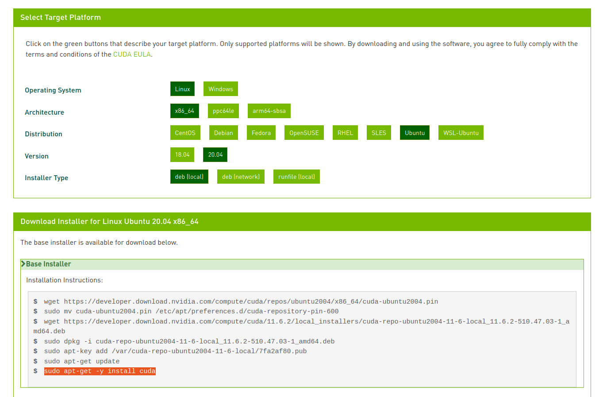
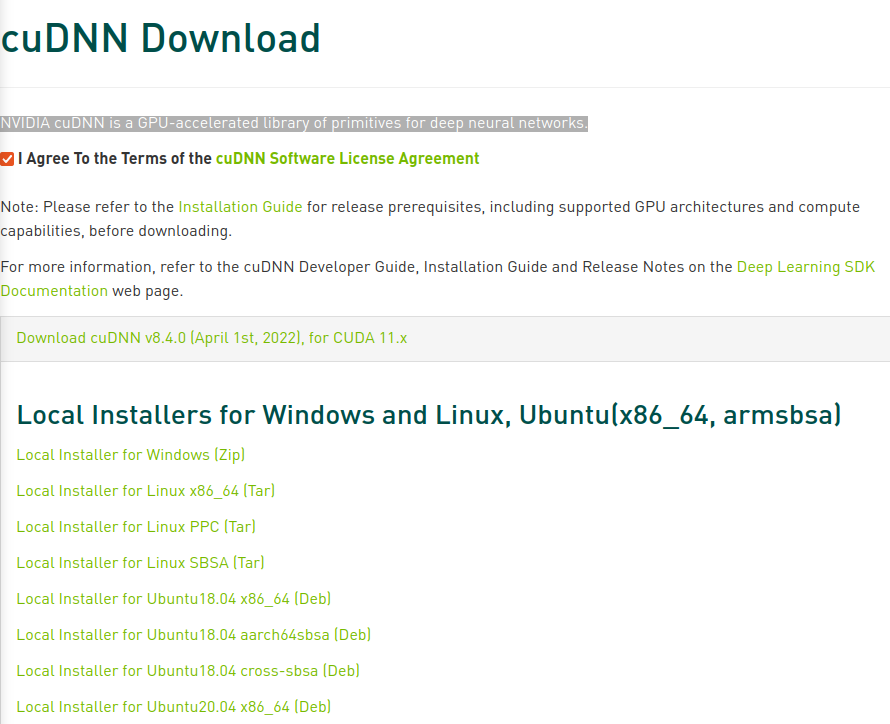

# Install driver
```bash
ubuntu-drivers devices
sudo ubuntu-drivers autoinstall
reboot
```

!!! Tip
    set `/etc/apt/sources.list` to `us.archive.ubuntu.com`

```
nvidia-smi

+-----------------------------------------------------------------------------+
| NVIDIA-SMI 510.60.02    Driver Version: 510.60.02    CUDA Version: 11.6     |
|-------------------------------+----------------------+----------------------+
| GPU  Name        Persistence-M| Bus-Id        Disp.A | Volatile Uncorr. ECC |
| Fan  Temp  Perf  Pwr:Usage/Cap|         Memory-Usage | GPU-Util  Compute M. |
|                               |                      |               MIG M. |
|===============================+======================+======================|
|   0  NVIDIA GeForce ...  Off  | 00000000:58:00.0 Off |                  N/A |
| N/A   43C    P0    N/A /  N/A |      9MiB /  2048MiB |      0%      Default |
|                               |                      |                  N/A |
+-------------------------------+----------------------+----------------------+
                                                                               
+-----------------------------------------------------------------------------+
| Processes:                                                                  |
|  GPU   GI   CI        PID   Type   Process name                  GPU Memory |
|        ID   ID                                                   Usage      |
|=============================================================================|
|    0   N/A  N/A       991      G   /usr/lib/xorg/Xorg                  4MiB |
|    0   N/A  N/A      1634      G   /usr/lib/xorg/Xorg                  4MiB |
+-----------------------------------------------------------------------------+

```

# cuda toolkit
[Nvidia install page](https://developer.nvidia.com/cuda-downloads?target_os=Linux&target_arch=x86_64&Distribution=Ubuntu&target_version=20.04&target_type=deb_local)



## Environment

```bash title=".bashrc"
export PATH=/usr/local/cuda-11.6/bin${PATH:+:${PATH}}
export LD_LIBRARY_PATH=/usr/local/cuda-11.6/lib64${LD_LIBRARY_PATH:+:${LD_LIBRARY_PATH}}
export CUDA_HOME=/usr/local/cuda
```

!!! Tip
    trick to avoid adding an extra : when $PATH is not set.
    ```
    ${PATH:+:${PATH}}
    ```
---

# cuDNN
NVIDIA cuDNN is a GPU-accelerated library of primitives for deep neural networks.

[Nvidia download](https://developer.nvidia.com/rdp/cudnn-download)

!!! Warning
    Need nvidia membership to download cuDNN



## Install
[install-guide](https://docs.nvidia.com/deeplearning/cudnn/install-guide/index.html#installlinux)

```
sudo dpkg -i cudnn-local-repo-ubuntu2004-8.4.0.27_1.0-1_amd64.deb 
sudo apt-key add /var/cudnn-local-repo-*/7fa2af80.pub
sudo apt-get update
sudo apt install libcudnn8=8.4.0.27-1+cuda11.6

```