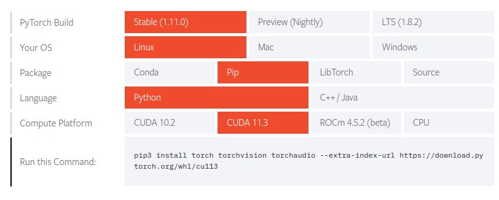

# Install
[pytorch.org](https://pytorch.org/get-started/locally/)



!!! Note
    PyTorch wheel came with it's on cuda and cuDNN

```python title="check torch installation"
import torch
>>> torch.__version__
1.5.1+cu101
>>> torch.version.cuda
10.1
>>> torch.cuda.current_device()
0
>>> torch.cuda.device_count()
1
>>> torch.backends.cudnn.version()
7603
>>> torch.cuda.is_available()
True

```