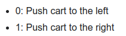

---
tags:
    - gym
    - gymnasium
    - ai
    - reinforcement learning
---

# Gymnasium
Gymnasium is an open source Python library for developing and comparing reinforcement learning algorithms by providing a standard API to communicate between learning algorithms and environments [more](https://pypi.org/project/gymnasium/)

## install

```bash
pip install gymnasium
# environment
# quat are mandatory
pip install "gymnasium[box2d]"

```

### Gym Environment


```bash title="install"
pip install "gymnasium[classic-control]"
pip install "gymnasium[atari]"
...
```

## Course
- [Python Reinforcement Learning using Gymnasium – Full Course](https://youtu.be/vufTSJbzKGU)
- [Reinforcement learning with Gymnasium (Farama Foundation)](https://colab.research.google.com/drive/1oNxRpRnht2Ogu5Id76YLLg_hkmwy-yKy?usp=sharing)
- [Gymnasium](https://gymnasium.farama.org/)


### Gym main concepts
- **Action Space**: Is the set of possible actions that an agent can take in the environment.
- **Observation Space**: Is the set of possible states that agent can observe in the environment.
- **Episode**: Is a complete run from initial state until terminate state. each episode is composed of a sequence of states, actions and rewards.

---

### Gym CartPole
[cart pole](https://gymnasium.farama.org/environments/classic_control/cart_pole/)

```python title="basic"
import gymnasium as gym

env = gym.make('CartPole-v1', render_mode='human')
env.reset()

print(f"observation_space max: {env.observation_space.high}")
print(f"observation_space min: {env.observation_space.low}")
print(f"Action space: {env.action_space.n}")


done = False
while not done:
    action = env.action_space.sample()
    new_state, reward, done, _, _ = env.step(action)
    env.render()
```

```bash title="output"
observation_space max: [4.8000002e+00 3.4028235e+38 4.1887903e-01 3.4028235e+38]
observation_space min: [-4.8000002e+00 -3.4028235e+38 -4.1887903e-01 -3.4028235e+38]
Action space: 2
```


- [action space](https://gymnasium.farama.org/environments/classic_control/cart_pole/#action-space)



- [observation space](https://gymnasium.farama.org/environments/classic_control/cart_pole/#observation-space)

