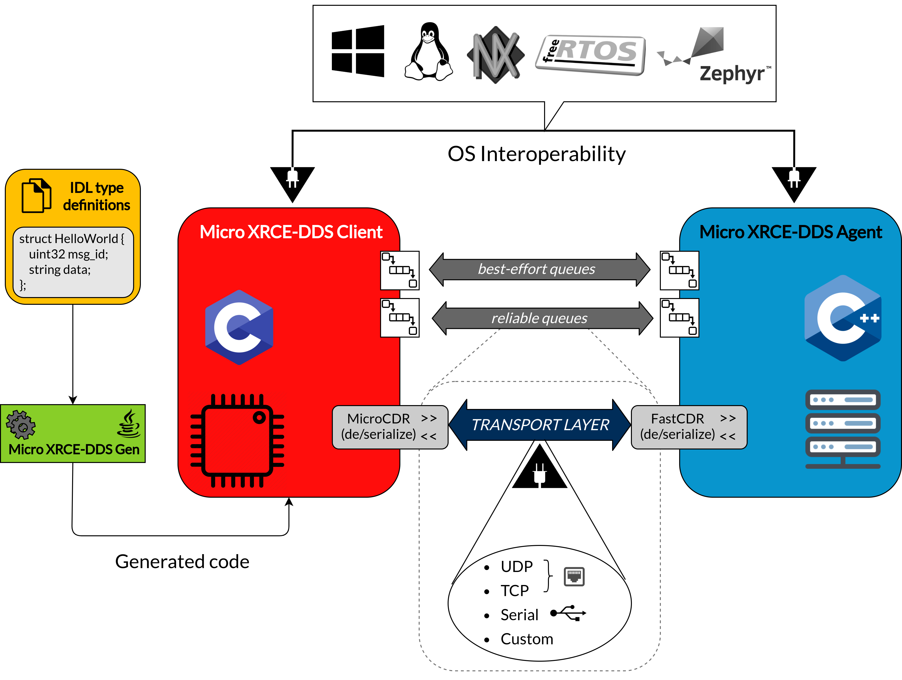
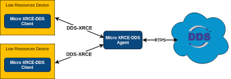

---
tags:
    - ros2
    - ardupilot
    - dds
    - micro ros
    - xrce
---

# Ardupilot with dds 
[Testing with DDS/micro-Ros](https://github.com/ArduPilot/ardupilot/tree/master/libraries/AP_DDS)

## XRCE
eXtremely Resource Constrained Environments

<!--  -->


- Micro XRCE-DDS Client
- Micro XRCE-DDS Agent
- Micro XRCE-DDS Gen

### Micro XRCE-DDS Client
[eProsima client](https://micro-xrce-dds.docs.eprosima.com/en/latest/client.html)
Client can communicate with the DDS Network as any other DDS actor could do. via Agent

### Micro XRCE-DDS Agent
[eProsima Agent](https://micro-xrce-dds.docs.eprosima.com/en/latest/agent.html)  

The eProsima Micro XRCE-DDS Agent acts as a server between the DDS Network and eProsima Micro XRCE-DDS Clients applications.

### Micro XRCE-DDS Gen
[eProsima gen](https://micro-xrce-dds.docs.eprosima.com/en/latest/gen.html)
eProsima Micro XRCE-DDS Gen is a Java application used to generate source code for the eProsima Micro XRCE-DDS software.

---

## Ardupilot Demo

Run demo explain by the [README](https://github.com/ArduPilot/ardupilot/tree/master/libraries/AP_DDS) file

---


### Install micro-ros
[First micro-ROS Application on Linux](https://micro.ros.org/docs/tutorials/core/first_application_linux/)

```
```

## Reference
- [Ardupilot dev conf 23 ardupilot DDS](https://www.youtube.com/live/4G1sxQ_CVng?feature=share&t=5156)
- [MicroXRCE DDS on Ardupilot](https://discourse.ros.org/t/microxrce-dds-on-ardupilot/29972/11)
- [REP-0147 A Standard interface for Aerial Vehicles](https://ros.org/reps/rep-0147.html)