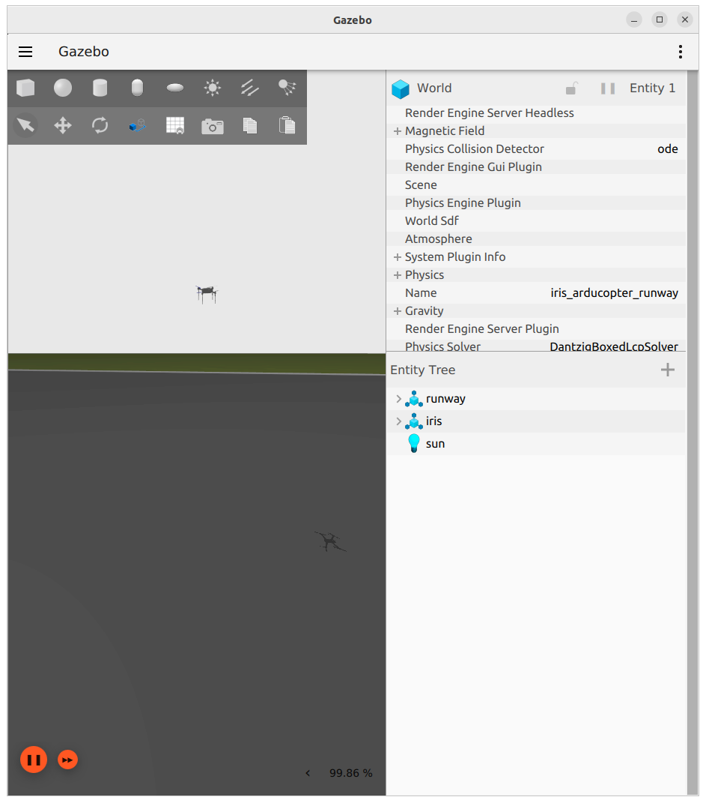

- ignition fortress
- MAVProxy (optional)

```
git clone -b <branchname> <remote-repo-url>
git clone -b ignition-fortress https://github.com/ArduPilot/ardupilot_gazebo.git
```


```bash title="terminal1"
export IGN_GAZEBO_SYSTEM_PLUGIN_PATH=$HOME/git/ardupilot_gazebo/build:${IGN_GAZEBO_SYSTEM_PLUGIN_PATH}
export IGN_GAZEBO_RESOURCE_PATH=$HOME/git/ardupilot_gazebo/models:$HOME/ardupilot_gazebo/worlds:${IGN_GAZEBO_RESOURCE_PATH}

# note remove sky tag from sdf
ign gazebo -v 4 -r iris_arducopter_runway.world
```

```bash title="terminal2 - run SITL"
/home/user/git/ardupilot/build/sitl/bin/arducopter -S --model JSON --speedup 1 --slave 0 --defaults /home/user/git/ardupilot/Tools/autotest/default_params/copter.parm,/home/user/git/ardupilot/Tools/autotest/default_params/gazebo-iris.parm -I0
```

```bash title="mavproxy"
mavproxy.py --master tcp:127.0.0.1:5760

# Arm and takeoff
mode guided
arm throttle
takeoff 5
```



---

# Reference
- [ardupilot_gazebo](https://github.com/ArduPilot/ardupilot_gazebo/tree/ignition-fortress)