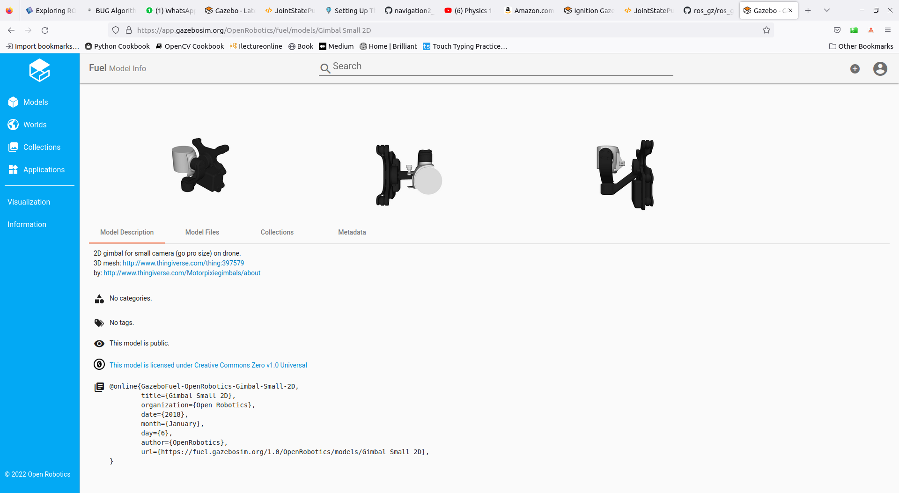

## Objective
Run Ardupilot (copter) SITL and ignition simulation
- fortress
- ardupilot_gazebo (plugin)
- MAVProxy


### ardupilot_gazebo
- clone `https://github.com/ArduPilot/ardupilot_gazebo.git`
  - ignition-garden branch
- build check instruction `https://github.com/ArduPilot/ardupilot_gazebo#installation-`

```bash
# Clone ardupilot_gazebo repository branch ignition-fortress
# git subfolder

mkdir ~/git
cd git
git clone -b <branchname> <remote-repo-url>
git clone -b ignition-garden https://github.com/ArduPilot/ardupilot_gazebo.git
```

#### Run
```bash title="terminal1"
export IGN_GAZEBO_SYSTEM_PLUGIN_PATH=$HOME/git/ardupilot_gazebo/build:${IGN_GAZEBO_SYSTEM_PLUGIN_PATH}
export IGN_GAZEBO_RESOURCE_PATH=$HOME/git/ardupilot_gazebo/models:$HOME/git/ardupilot_gazebo/worlds:${IGN_GAZEBO_RESOURCE_PATH}

# note remove sky tag from sdf
ign gazebo -v 1 -r iris_arducopter_runway.world
```

#### SITL
```bash title="terminal2 - run SITL"
./arducopter -S --model JSON \
--speedup 1 \
--defaults copter.parm,gazebo-iris.parm \
-I0
```

#### MAVProxy

```bash title="mavproxy"
mavproxy.py --master tcp:127.0.0.1:5760

# Arm and takeoff
mode guided
arm throttle
takeoff 5
```


---


## iris with gimbal and camera

- Use `iris_with_ardupilot` model
- Add `Sensors` plugin to world
- Load model from fule
- change camera sensor topic to `/gimbal/camera`
- Run bridge
- View camera image in `rqt_image_view`


```xml title="Add sensors plugin to world"
<plugin
  filename="ignition-gazebo-sensors-system"
  name="ignition::gazebo::systems::Sensors">
  <render_engine>ogre2</render_engine>
</plugin>
```


[fule dashboard](https://app.gazebosim.org/OpenRobotics/fuel/models/Gimbal%20Small%202D)


```xml title="load model from fule"
<include>
  <name>gimbal_small_2d</name>
  <uri>https://fuel.gazebosim.org/1.0/OpenRobotics/models/Gimbal Small 2D</uri>
  <pose>0 -0.01 0.070 1.57 0 1.57</pose>
</include>
```

!!! tip "gz cache location"
     ```bash
     ~/.ignition/fuel
     # 
     ~/.ignition/fuel/fuel.gazebosim.org/openrobotics/models
     ```


```bash title="run bridge"
ros2 run ros_gz_bridge parameter_bridge /gimbal/camera@sensor_msgs/msg/Image@ignition.msgs.Image
```

```bash title="run RQT"
ros2 run rqt_image_view rqt_image_view /gimbal/camera
```


---

# Reference
- [ardupilot_gazebo](https://github.com/ArduPilot/ardupilot_gazebo/tree/ignition-fortress)
- [ros gz bridge](https://index.ros.org/p/ros_gz_bridge/)