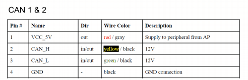

---
tags:
    - ardurover
---

### firmware
[ardupilot firmware](https://firmware.ardupilot.org/)

[orange cube](https://firmware.ardupilot.org/Rover/stable-4.2.3/CubeOrange/)

upload firmware using `uploader.py` from 
`/Tools/scripts/uploader.py <firmware file>`

### connect using mavprxy

```
mavproxy.py --master /dev/ttyACM0
```

### lua
upload lua scripts using mavftp from mavproxy

```bash
module load ftp
```

- list: list directory contents
- get: download a file
- put: write a file
- rm: remove a file
- rmdir: remove an empty directory
- rename: rename a file
- mkdir: create a directory


```
HOLD> ftp list APM
Listing APM
 D LOGS

HOLD> ftp mkdir APM/scripts
HOLD> Creating directory APM/scripts

HOLD> ftp list APM
HOLD> Listing APM
 D LOGS
 D STRG_BAK
 D scripts


# put
#ftp put <file full path> <remote full path>


```

### enable scripts
param show SCR_ENABLE       0
param set SCR_ENABLE 1


---

## Canbus



### ardupilot

|   |   |
|---|---|
| CAN_P1_DRIVER  | 1  |
| CAN_D1_PROTOCOL  | 10  |
| CAN_P1_BITRATE  | 1000000  |

```
param show CAN_P1_DRIVER
param set CAN_P1_DRIVER 1
param set CAN_D1_PROTOCOL 10
#reboot
param set CAN_P1_BITRATE 125000
```

---


--- 

## Reference
- [USB2CAN MODULE User Manual](https://docs.rs-online.com/5b40/A700000008257389.pdf)
- [pixhawk cube pinout](https://discuss.ardupilot.org/t/pixhawk-2-1-pinout-doc-need-to-be-on-the-pixhawk-2-1-page/23604)
- [](https://discuss.ardupilot.org/t/can-bus-arduino-communication/93728)