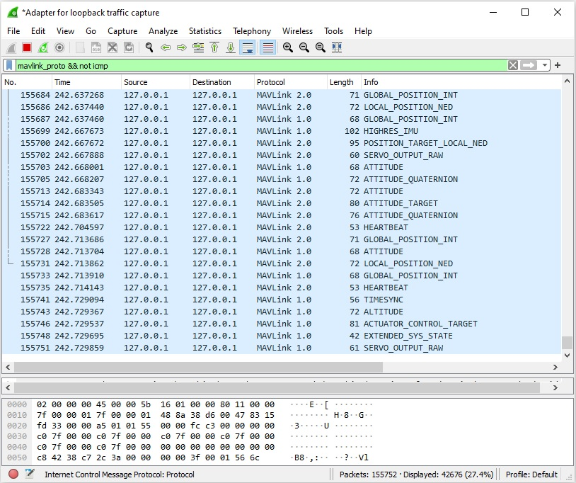

---
tags:
    - mavlink
    - wireshark
    - lua
---

Using wireshark plugin to parse mavlink traffic

## Generate plugin
- Clone Mavlink
- Install pymavlink

```bash title="clone"
git clone https://github.com/mavlink/mavlink.git --recursive
```


```bash title="generate plugin"
python3 -m pymavlink.tools.mavgen \
--lang=WLua --wire-protocol=2.0 \
--output=mavlink_2_common \
message_definitions/v1.0/common.xml
```

---

## Wireshark
!!! tip "Running wireshark as non-root user"
    - Add user to wireshark group
    - login 
    - run wireshark as non-root

    ```bash
    sudo usermod -a -G wireshark $USER
    ```

    [more](https://askubuntu.com/questions/74059/how-do-i-run-wireshark-with-root-privileges)

### Install plugin
!!! tip "install wireshark plugin as non-root user"
    Copy generated lua script to

    ```bash
    ~/.local/lib/wireshark/plugins
    ```
#### Check for loaded plugin
Help > About Wireshark > Plugins

---

## usage

```bash title="filter"
mavlink_proto && not icmp
```

```bash title="filter by message id"
mavlink_proto.msgid==0
```



---

## Reference
- [Parsing MAVLink in Wireshark](https://mavlink.io/en/guide/wireshark.html)