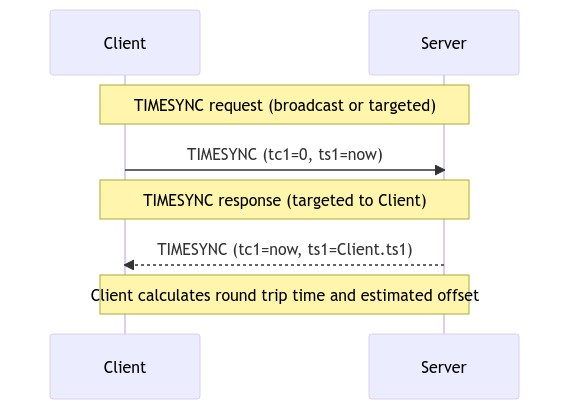

---
tags:
    - ardupilot
    - timesync
---

# Clock/Time Synchronized
The flight controller and companion computer clocks can be synchronized using MAVLink’s SYSTEM_TIME and TIMESYNC messages. This is important so that each side can blend data from the other side into its EKF.

## Time Synchronization Protocol
This protocol is used to synchronize clocks on MAVLink components by estimating their time offset.

A component that wants to synchronize clocks sends out a TIMESYNC request with its current timestamp in `ts1`. A remote system that supports the protocol sends a TIMESYNC response, including both the original timestamp in `ts1` field and its own timestamp in `tc1`.

## Demo: sync between CC and SITL/Ardupilot

---

## Reference
- [Clock/Time synchronized](https://ardupilot.org/dev/docs/ros-timesync.html)
- [Time Synchronization Protocol v2](https://mavlink.io/en/services/timesync.html)