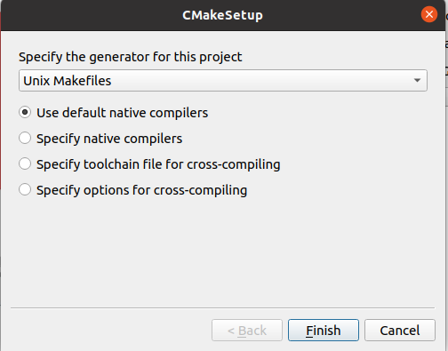
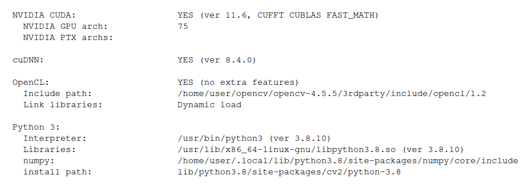
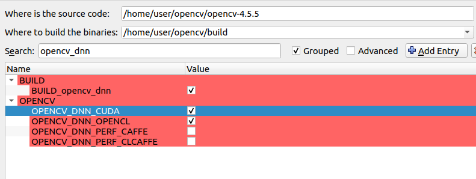
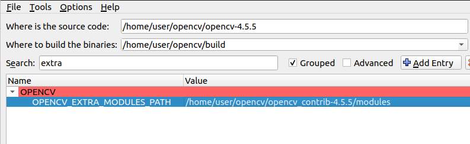

Build OpenCV on x64 ubuntu machine

## Prepared
- Using cmake GUI
```bash
sudo apt install cmake-qt-gui
```

### Download source
```
wget https://github.com/opencv/opencv_contrib/archive/refs/tags/4.5.5.zip
```
---

## build process
- set all option
- run configure 
- run generate
- run make -j 8 from/on build folder
- check

## config



- Select source and build folder


- config python


- config cuda


- gpu arch
[wikipedia cuda gpu support](https://en.wikipedia.org/wiki/CUDA#GPUs_supported)




- dnn



- blas


- fast math


- contrib
  


- pkgconfig


### config result
- show `my changes`

```
Commandline options:
-DOPENCV_EXTRA_MODULES_PATH:PATH="/home/user/opencv/opencv_contrib-4.5.5/modules" \
-DOPENCV_GENERATE_PKGCONFIG:BOOL="1" \
-DWITH_CUDA:BOOL="1" \
-DCUDA_ARCH_BIN:STRING="7.5" \
-DOPENCV_DNN_CUDA:BOOL="1" \
-DENABLE_FAST_MATH:BOOL="1" \
-DPYTHON3_EXECUTABLE:FILEPATH="/usr/bin/python3" -DBUILD_opencv_world:BOOL="1" \
-DCUDA_FAST_MATH:BOOL="1" 


Cache file:
OPENCV_EXTRA_MODULES_PATH:PATH=/home/user/opencv/opencv_contrib-4.5.5/modules
OPENCV_GENERATE_PKGCONFIG:BOOL=1
WITH_CUDA:BOOL=1
CUDA_ARCH_BIN:STRING=7.5
OPENCV_DNN_CUDA:BOOL=1
ENABLE_FAST_MATH:BOOL=1
PYTHON3_EXECUTABLE:FILEPATH=/usr/bin/python3
BUILD_opencv_world:BOOL=1
CUDA_FAST_MATH:BOOL=1

```
---


## Check
- create new virtual env and activate
- run setup.py from `build/python_loader` folder


```python
import cv2
cv2.__version__
cv2.cuda.getCudaEnabledDeviceCount()

```