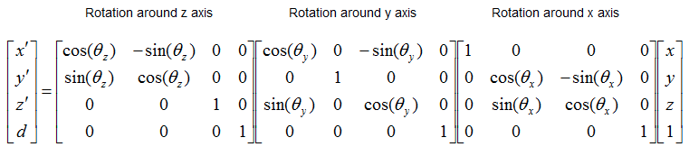
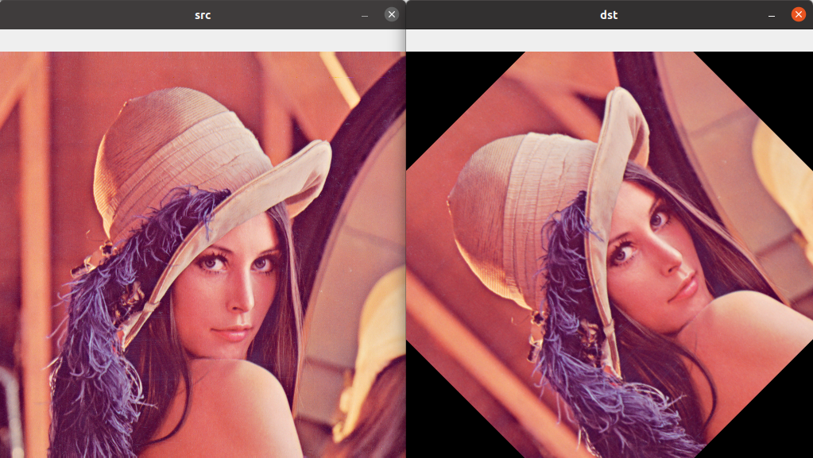

# Translation


## opencv demo

```python
--8<-- "examples/open_cv/computer_vision/transform.py"
```


---

# Rotation





```python title="rotate" 
import cv2
import numpy as np

image = cv2.imread('/home/user/projects/blog/examples/open_cv/homography/images/lana.png')

height, width = image.shape[:2]
center = (width / 2, height / 2)
angle = 45
scale = 1
M = cv2.getRotationMatrix2D(center, angle, scale)

img_translation = cv2.warpAffine(image, M, (width, height))

cv2.imshow("src", image)
cv2.imshow("dst", img_translation)

cv2.waitKey(0)

```



---

# Scale


---

# Reference
- [Pratik jain computer vision](https://www.youtube.com/watch?v=vqdshHpkvkg&list=PLFXza2AmUJa-RJZJj3b5Wm76I9k_QthWC)
- [How to resize, translate, flip and rotate an image with OpenCV](https://datahacker.rs/003-how-to-resize-translate-flip-and-rotate-an-image-with-opencv/)
- [understanding-geometric-transformation](https://theailearner.com/2020/11/01/understanding-geometric-transformation-translation-using-opencv-python/)