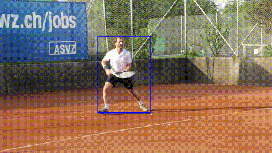

# SiamMask
SiamMask used to tracking and segment objects from videos in each frame, initializing a single bounding box and outputing binary segmentation mask and rotated objects boxes

SiamMask needs to be initialized with a single bounding box so it can track the desired object. However, this also means that multiple object tracking (MOT) is not viable with SiamMask

---

## alias

- VOT: Visual Object Tracking
- MOT: Multiple Object Tracking
- VOS: Video Object Segmentation
- SOT: Signal Object Tracking
---

## Demo

- Clone project
- Setup environment
- Download model
- Run

```bash title="clone"
git clone https://github.com/augmentedstartups/SiamMask.git
```

!!! Note title="requirements.txt"
    Running different python package version from github settings

    Cython==0.29.28
    colorama==0.4.4
    numpy==1.21.5
    requests==2.22.0
    fire==0.4.0
    torch==1.5.1+cu101
    matplotlib==3.5.1
    numba==0.55.1
    scipy==1.7.3
    h5py==3.6.0
    pandas==1.4.0
    tqdm==4.64.0
    tensorboardX==2.5
    torchvision==0.6.1+cu101

    **build from source**
    opencv 4.5.4

```bash
cd SiamMask
bash make.sh
```

```bash title="setp env"
# Add SiamMask root project and demo folder siammask_sharp folder to PYTHONPATH
cd SiamMask
export PYTHONPATH=`pwd`:$PYTHONPATH

cd experiments/siammask_sharp
export PYTHONPATH=`pwd`:$PYTHONPATH
```


```bash title="download models"
cd SiamMask/experiments/siammask_sharp
wget http://www.robots.ox.ac.uk/~qwang/SiamMask_VOT.pth
wget http://www.robots.ox.ac.uk/~qwang/SiamMask_DAVIS.pth
```

```bash title="run
python ../../tools/demo.py --resume SiamMask_DAVIS.pth --config config_davis.json
```



!!! Note
    DAVIS_2016: Video object segmentation dataset  
    DAVIS16 is a dataset for video object segmentation which consists of 50 videos in total (30 videos for training and 20 for testing). Per-frame pixel-wise annotations are offered.  
    [dataset](https://www.v7labs.com/open-datasets/davis-2016)
---

# Reference
- [SiamMask](https://github.com/foolwood/SiamMask)
- [Siam Mask Object Tracking and Segmentation in OpenCV Python](https://www.augmentedstartups.com/SiamMask-course_YT)
- [SiamMask github](https://github.com/augmentedstartups/SiamMask)

## To check
SenseTime Research platform for single object tracking, implementing algorithms like SiamRPN and SiamMask
- [pysot](https://github.com/STVIR/pysot)