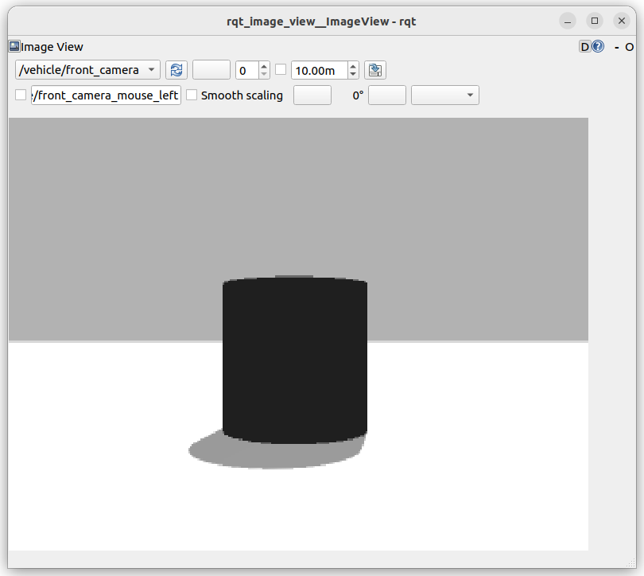

!!! tip ""
    check `camera_sensor.sdf` at example worlds


!!! warning ""
    don't forget world sensors plugin
    ```xml
    <plugin
      filename="ignition-gazebo-sensors-system"
      name="ignition::gazebo::systems::Sensors">
      <render_engine>ogre2</render_engine>
    </plugin>
    ```

```xml
<sensor name="camera" type="camera">
    <camera>
    <horizontal_fov>1.047</horizontal_fov>
    <image>
        <width>320</width>
        <height>240</height>
    </image>
    <clip>
        <near>0.1</near>
        <far>100</far>
    </clip>
    </camera>
    <always_on>1</always_on>
    <update_rate>15</update_rate>
    <visualize>true</visualize>
    <topic>/vehicle/front_camera</topic>
</sensor>
```
     
```bash
ign topic --list | grep camera
# result
/gui/camera/pose
/vehicle/camera_info
/vehicle/front_camera

# info
ign topic --info --topic /vehicle/front_camera
Publishers [Address, Message Type]:
  tcp://172.18.0.1:45921, ignition.msgs.Image

# echo
ign topic --echo -t /vehicle/front_camera

# msg
ign msg --info ign_msgs.Image
Name: ignition.msgs.Image
File: ignition/msgs/image.proto

message Image {
  .ignition.msgs.Header header = 1;
  uint32 width = 2;
  uint32 height = 3;
  uint32 step = 4;
  bytes data = 5;
  .ignition.msgs.PixelFormatType pixel_format_type = 6;
}

```

---
## ignition image_display


### Add ImageDisplay to sdf
- Add `ImageDisplay` plugin under `gui` tag
```xml
<plugin filename="ImageDisplay" name="Image Display">
    <ignition-gui>
        <property key="state" type="string">docked</property>
    </ignition-gui>
</plugin>
```
---

## ros2 bridge
!!! note "ros_gz_bridge"
     https://github.com/gazebosim/ros_gz/tree/humble/ros_gz_bridge


!!! tip ""
     don't forget to hit play, or Gazebo Sim won't generate any images

```bash title="terminal2"
ros2 run ros_gz_bridge parameter_bridge /vehicle/front_camera@sensor_msgs/msg/Image@ignition.msgs.Image
```

```bash title="terminal3"
ros2 run rqt_image_view rqt_image_view /vehicle/front_camera
```
     
