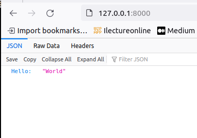

# Docker Python application
base on [Dockerize a Python web app](https://github.com/patrickloeber/python-docker-tutorial/tree/main/example2)


## Project
```bash
├── app
│   └── main.py
├── .devcontainer
│   ├── devcontainer.json
│   └── Dockerfile
├── README.md
└── requirements.txt
```

```bash title="requirements.txt"
uvicorn
fastapi
```

```Dockerfile title="Dockerfile"
FROM python:3.8.12-slim as app_base

WORKDIR /code

COPY ./requirements.txt /code/requirements.txt

RUN pip install --no-cache-dir --upgrade -r /code/requirements.txt

COPY ./app /code/app

CMD ["uvicorn", "app.main:app", "--host", "0.0.0.0", "--port", "80"]
```

---

### Build
from .devcontainer folder run

```
docker build -t fastapi-image -f Dockerfile ..
```

### Run

```
docker run -p 8000:80 fastapi-image
```

### Usage



---

## Using ubuntu as base image
Using ubuntu 22.04 as base image add user uid 1000 and install support packages  
In this example we use python tkinter basic application

```bash
.
├── app
│   └── main.py
├── .devcontainer
│   ├── devcontainer.json
│   ├── Dockerfile.python
│   └── Dockerfile.ubuntu
├── README.md
└── requirements.txt
```

```dockerfile title="Dockerfile.ubuntu" linenums="1" hl_lines="3-4 13"
FROM ubuntu:22.04 as base

ARG DEBIAN_FRONTEND=noninteractive
ENV TZ=Etc/UTC

ARG USERNAME=user
ARG USER_UID=1000
ARG USER_GID=1000

RUN groupadd --gid $USER_GID $USERNAME \
    && useradd -s /bin/bash --uid $USER_UID --gid $USER_GID -m $USERNAME \
    && apt-get update \
    && apt-get install -y sudo tzdata \
    && echo $USERNAME ALL=\(root\) NOPASSWD:ALL > /etc/sudoers.d/$USERNAME\
    && chmod 0440 /etc/sudoers.d/$USERNAME \
    && rm -rf /var/lib/apt/lists/* 

RUN apt-get update && apt-get install -y \
    python3 \
    python3-pip \
    python3-tk \
    && apt-get -y clean && rm -rf /var/lib/apt/lists/*

WORKDIR /app

COPY ./requirements.txt /app/requirements.txt

RUN pip install --no-cache-dir --upgrade -r /app/requirements.txt

COPY ./app/main.py .

CMD ["main.py"]  
ENTRYPOINT ["python3"]
```

```python title="main.py"
import tkinter as tk

# Tkinter Window
root_window = tk.Tk()

# Window Settings
root_window.title('Application Title')
root_window.geometry('300x100')
root_window.configure(background = '#353535')

# Text
tk.Label(root_window, text='Hello World', fg='White', bg='#353535').pack()

# Exit Button
tk.Button(root_window, text='Exit', width=10, command=root_window.destroy).pack()

# Main loop
root_window.mainloop()
```

### Build

```bash
docker -t app:ubuntu -f Dockerfile.ubuntu ..
```

### Run
With gui

```bash
docker run  \
    -u=$(id -u $USER):$(id -g $USER) \
    -e DISPLAY=$DISPLAY \
    -v /tmp/.X11-unix:/tmp/.X11-unix:rw \
    --rm \
    app:ubuntu

```