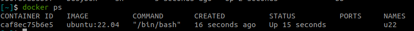

---
tags:
    - docker
    - tutorial
    - tips
---

# Docker usage
Docker usage example from `cli` and `docker-compose`

- [Run docker set container name and hostname](#demo)
- [Run docker, as none root](#demo-ii)


## Demo
- prebuilt image `ubuntu:22.04`
  
### cli

```bash
docker run -it --rm --name u22 --hostname dev ubuntu:22.04 /bin/bash

root@dev:/#
```




---

### docker-compose

!!! tip "docker compose error"
    ```
    docker.credentials.errors.InitializationError: docker-credential-desktop not installed or not available in PATH
    ```

    edit `~/.docker/config.json`
    Change `credsStore` to `credStore`

    ```json
    {
        "stackOrchestrator" : "swarm",
        "experimental" : "disabled",
        "credStore" : "desktop"
    }
    ```

```yaml
version: "3"

services:
  demo:
    container_name: my_container_name
    image: ubuntu:22.04
    hostname: dev
    stdin_open: true 
    tty: true
```
     
```bash title="terminal1"
docker-compose up
```


```bash title="terminal2"
docker exec -it py_docker_tutorial_demo_1 /bin/bash

root@dev:/# 
```

```bash title="terminal3"
docker-compose down
```

---

## Demo II
- prebuilt image `ubuntu:22.04`
- Docker build with user `user` see note

```bash
docker run -it --rm \
--name u22 \
--hostname dev \
--user user \
--workdir /home/user \
ubuntu:22.04 /bin/bash


user@dev:/$
```

!!! note "Add user to Dockerfile with sudo support"
     ```
    ARG USERNAME=user
    ARG USER_UID=1000
    ARG USER_GID=$USER_UID

    # Create a non-root user
    RUN groupadd --gid $USER_GID $USERNAME \
    && useradd -s /bin/bash --uid $USER_UID --gid $USER_GID -m $USERNAME \
    # [Optional] Add sudo support for the non-root user
    && apt-get update \
    && apt-get install -y sudo \
    && echo $USERNAME ALL=\(root\) NOPASSWD:ALL > /etc/sudoers.d/$USERNAME\
    && chmod 0440 /etc/sudoers.d/$USERNAME \
    # Cleanup
    && rm -rf /var/lib/apt/lists/* 
     ```


```yaml
version: "3"

services:
demo:
    container_name: my_container_name
    image: ubuntu:22.04
    hostname: dev
    stdin_open: true 
    tty: true
    user: user
    working_dir: /home/user
```

```bash title="terminal1"
docker-compose up
```

```bash title="terminal2"
docker exec -it py_docker_tutorial_demo_1 /bin/bash

user@dev:~$ pwd
/home/user
```

```bash title="terminal3"
docker-compose down
```