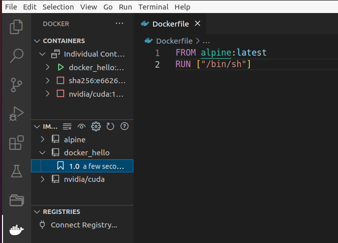

## Simple Run

- from docker ext `run iteractive`




## Using docker-compose

[How To Install and Use Docker Compose on Ubuntu 20.04](https://www.digitalocean.com/community/tutorials/how-to-install-and-use-docker-compose-on-ubuntu-20-04)
```bash title="install"
# copy to /usr/local/bin
sudo curl -L "https://github.com/docker/compose/releases/download/1.29.2/docker-compose-$(uname -s)-$(uname -m)" -o /usr/local/bin/docker-compose

# Set permission
sudo chmod +x /usr/local/bin/docker-compose
```

---

## cli
Run docker image using compose file

```bash title="usage"
# cd to `docker-compose.yml` location

docker-compose up

```