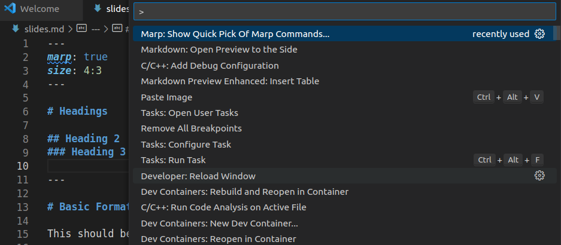
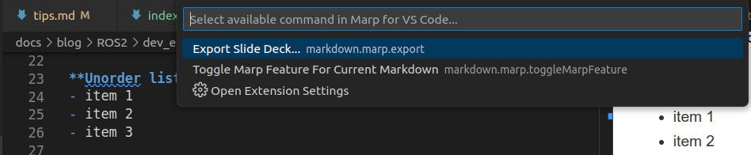

---
tags:
    - vscode
    - marpit
    - presentation
    - marp
    - markdown
    - mermaid
---
# Marpit: Markdown presentation


## Usage
```markdown title="slides.md"
---
marp: true
size: 4:3
---

# Headings

## Heading 2
### Heading 3

---

# Basic Formatting

This should be **bold** and *italic*.

**Unorder list**
- item 1
- item 2
- item 3

---

**Order list**
1. item 1
1. item 2
1. item 3
```

### Preview
!!! tip "View Marpit presentation"
    Use command: Markdown: Open Preview to the side 
    and not the command that belong to **Markdown Preview Enhanced**
     


### Toggle marpit



---

## Export
marp export to: HTML, PDF, PPTX




```json
"markdown.marp.exportType": "pdf"
```

---
## How to and Tips
### theme

```yaml
---
title: demo marpit presentation
description: example slide
marp: true
size: 4:3
paginate: true
theme: gaia
---
```


### settings
- **paginate**: Shows page number on the slide or not
- **size**: 

### Images
```
---

 
- image on the left, with text on the right
---

 
- same of above, but image is 33% of the slide)

---
```


---

## Reference
- [Unleash Your Creativity with Marp Presentation Customization ](https://dev.to/chris_ayers/unleash-your-creativity-with-marp-presentation-customization-1cpn)