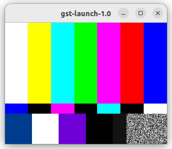

## Demo
- Create virtual device
- Create pipe write to virtual device
- Create pipe read from device
  
```bash title="create virtual camera"
sudo modprobe v4l2loopback video_nr="42" \
    'card_label=virtcam' \
    exclusive_caps=1 \
    max_buffers=2
```

```bash title="terminal1"
gst-launch-1.0 videotestsrc \
! videoconvert \
! v4l2sink device=/dev/video42
```

```bash title="terminal2"
gst-launch-1.0 v4l2src device=/dev/video42 \
! videoconvert \
! autovideosink
```



!!! note "remove virtual camera"
    ```
    sudo modprobe -r v4l2loopback
    ```
     