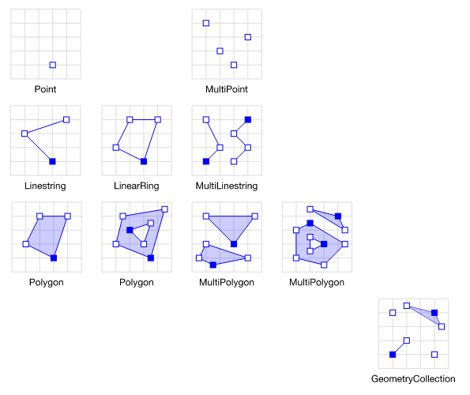

---
tags:
    - kml
    - python
    - geo
    - gis
---

# Calc polygon area from KML

## KML
Keyhole Markup Language (KML) is an XML notation for expressing geographic annotation and visualization within two-dimensional maps and three-dimensional Earth browsers (wikipedia)

KML tags can divide into three categories
1. Feature
2. Geometry
3. Style

### Feature
Container Tag for our Demo, Placemark hole Geometry and metadata for specific location
### Geometry
- Point
- LineString
- Polygon
- Linear Ring




### Style
Drawing style for different geometries

---

## Code
The demo KML contain one placemark with one polygon

### Packages
#### fastkml
Fastkml is a library to read, write and manipulate KML files
#### pygeoif
PyGeoIf provides a interface protocol for geo-spatial (GIS) vector data
#### pyproj
cartographic projections and coordinate transformations library
#### shapely
Shapely is Python package for manipulation and analysis of planar geometric objects. 

---

```python
"""
pip install fastkml
pip install shapely
pip install pyproj
"""
from fastkml import kml
from fastkml.kml import Placemark, Document
from pygeoif.geometry import Polygon
from pyproj import Geod
import shapely.geometry.polygon
from os import path

file_path = "/workspaces/gis_tutorial/data/test.kml"
with open(file_path, "r", encoding="utf-8") as f:
    doc = f.read()
k = kml.KML()
# lxml support encoding issue
doc = bytes(bytearray(doc, encoding="utf-8"))
k.from_string(doc)
features = list(k.features())

document: Document = features[0]
placemark: Placemark
for placemark in document.features():
    geo: Polygon = placemark.geometry
    poly_points = [(lat, lon) for lat, lon, _ in geo.exterior.coords]
poly_points.reverse()
poly = shapely.geometry.polygon.Polygon(poly_points)
geod = Geod(ellps="WGS84")
poly_area, poly_perimeter = geod.geometry_area_perimeter(poly)

print(poly_area)
print(poly_perimeter)
```

# Reference
- [The 4 Most Common Geometries in KML](https://medium.com/@yankuan/the-4-most-common-geometries-in-kml-ef9096231e59)
- [The Definite (& ONLY) Guide to FastKML.](https://medium.com/@wwaryan/the-definite-only-guide-to-fastkml-58b8e19b8454)