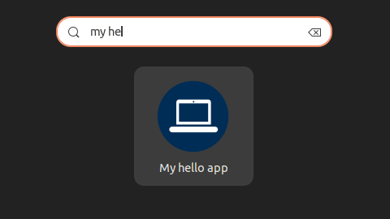

---
tags:
    - deb
    - stdeb
    - python
    - project
    - package
---

# From simple script to DEB package
Create debian package for simple python script
using `stdeb`
control dependencies and add shortcut to launch the script


## Project

```bash title="project structure"
python_deb_tutorial
├── python_deb_tutorial
│   ├── hello.py
│   └── __init__.py
├── README.md
└── setup.py
```

```python title="setup.py"
from setuptools import setup, find_packages

setup(
    name='my_script',
    version='0.0.1',
    description='very simple script',
    packages=find_packages(),
    entry_points={
        'console_scripts': [
            'hello = python_deb_tutorial.hello:main',
        ],
    }
)
```

```python title="hello.py"
#! /usr/bin/python3

def main():
    print("hello deb")

```

## create package

```bash
python setup.py --command-packages=stdeb.command bdist_deb
```

## install. run. remove deb
```bash title="install"
# from project folder
sudo dpkg -i deb_dist/python3-my-script_0.0.1-1_all.deb
```

```bash title="run"
# script installed in `/usr/bin` folder
# just call the entry name from the setup.py
#
hello
```

```bash title="remove"
sudo dpkg -r python3-my-script
```

---

## Add shortcut and icon
- Add my-script.png
- Add my-script.desktop


```bash title="project structure"
python_deb_tutorial
├── python_deb_tutorial
│   ├── hello.py
│   └── __init__.py
├── README.md
├── my-script.desktop
├── my-script.png
└── setup.py
```

```ini title="my-script.desktop"
[Desktop Entry]
Name=My hello app
Exec=/usr/bin/hello
Icon=/usr/share/icons/my-script.png
Terminal=true
Type=Application
```

```python title="setup.py"
from setuptools import setup, find_packages

setup(
    name='my_script',
    version='0.0.1',
    description='very simple script',
    packages=find_packages(),
    entry_points={
        'console_scripts': [
            'hello = python_deb_tutorial.hello:main',
        ],
    },
    data_files = [
        ('share/applications/', ['my-script.desktop']),
        ('share/icons/', ['my-script.png'])
    ]
)
```

### try



---

## Add package dependencies

### python packages
- Add `install_requires` to setup.py
  
```python
install_requires=[
        'dependency1',
        'dependency2',
        'dependency3'
    ],
```


### deb packages
- Add `stdeb.cfg` to project root same level of `setup.py`

```bash title="project structure"  linenums="1" hl_lines="6"
python_deb_tutorial
├── python_deb_tutorial
│   ├── hello.py
│   └── __init__.py
├── README.md
├── stdeb.cfg
└── setup.py
```

```c title="stdeb.cfg"
[DEFAULT]
maintainer = robo be <you@example.com>
Depends3: python3-pip, python3-loguru
```

```bash title="create"
python setup.py --command-packages=stdeb.command bdist_deb
```

```bash title="check" linenums="1" hl_lines="14 16"
# dpkg -I <package>.deb
dpkg -I deb_dist/python3-my-script_0.0.1-1_all.deb
#
size 29036 bytes: control archive=1160 bytes.
     254 bytes,    10 lines      control              
     907 bytes,    10 lines      md5sums              
     585 bytes,    19 lines   *  postinst             #!/bin/sh
     201 bytes,     7 lines   *  postrm               #!/bin/sh
     413 bytes,    12 lines   *  prerm                #!/bin/sh
 Package: python3-my-script
 Source: my-script
 Version: 0.0.1-1
 Architecture: all
 Maintainer: robo be <you@example.com>
 Installed-Size: 57
 Depends: python3:any, python3-pip, python3-loguru
 Section: python
 Priority: optional
 Description: very simple script
```

```bash title="Install"
# using apt to install deb with all dependencies
sudo apt install ./python3-my-script_0.0.1-1_all.deb
```

!!! note "deb with dependencies"
    Use `apt install` to install deb with dependencies
     