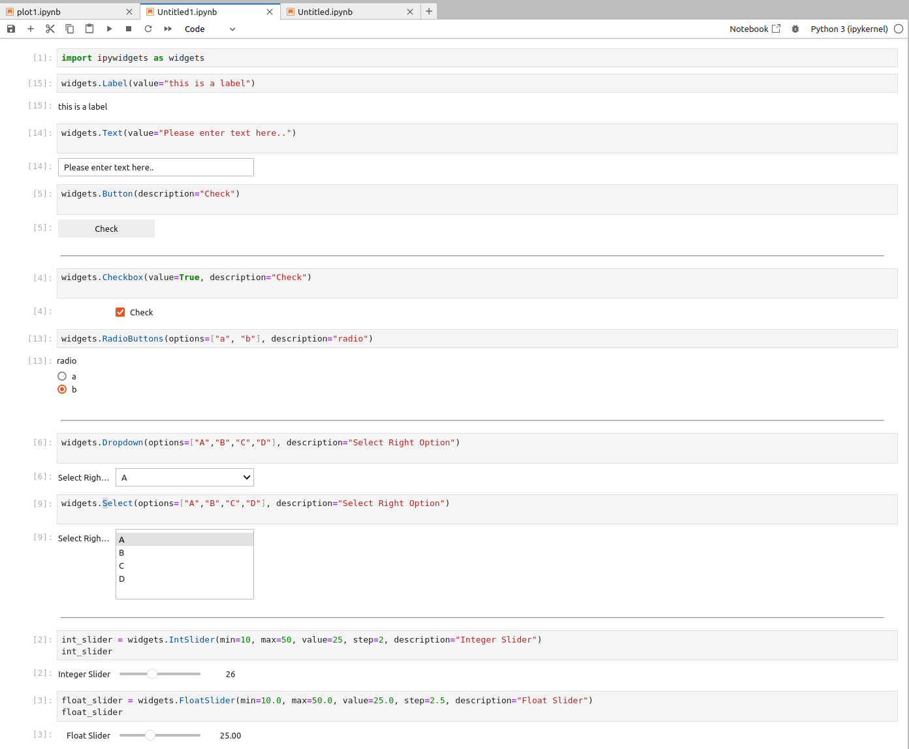

---
tags:
    - jupyter
    - widgets
    - interactive
    - python
    - ipywidgets
    - gui
---

# Jupyter interactive UI
Create jupyter interactive UI using ipywidgets

[widgets list](https://ipywidgets.readthedocs.io/en/stable/examples/Widget%20List.html)

### Examples

```python
import ipywidgets as widgets
# support multiple output
from IPython.core.interactiveshell import InteractiveShell
InteractiveShell.ast_node_interactivity = "all"
```

```python title="label text and button"
widgets.Label(value="this is a label")
widgets.Text(value="Please enter text here..")
widgets.Button(description="Check")
```

```python title="check and radio"
widgets.Checkbox(value=True, description="Check")
widgets.RadioButtons(options=["a", "b"], description="radio")
```

```python title="select and dropdown"
# select
widgets.Select(options=["A","B","C","D"], description="Select Right Option")

# dropdown
widgets.Dropdown(options=["A","B","C","D"], description="Select Right Option")

```

```python title="sliders"
# int slider
widgets.IntSlider(min=10, max=50, value=25, step=2, description="Integer Slider")

# float slider
widgets.FloatSlider(min=10.0, max=50.0, value=25.0, step=2.5, description="Float Slider")

# vertical
widgets.IntSlider(min=10, max=50, value=25, step=2, description="Integer Slider", orientation="vertical")
```




## Events

[Widget Events](https://ipywidgets.readthedocs.io/en/latest/examples/Widget%20Events.html)

---

## Reference
- [ipywidgets: Interactive Widgets in Jupyter Notebooks (Complete Guide)](https://coderzcolumn.com/tutorials/python/interactive-widgets-in-jupyter-notebook-using-ipywidgets)
- [Jupyter widgets](https://ipywidgets.readthedocs.io/en/latest/examples/Widget%20Basics.html)