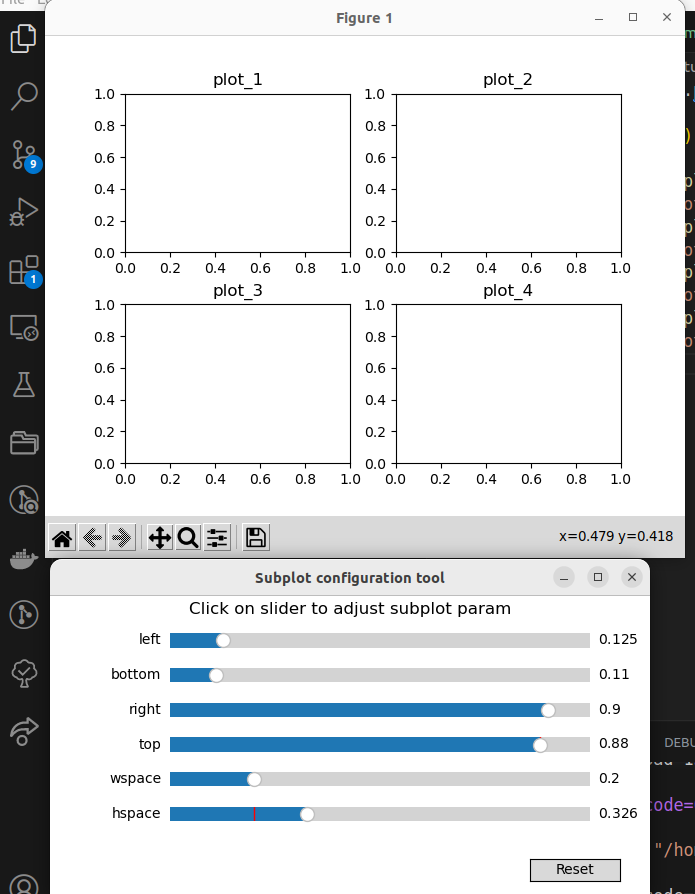

---
tags:
    - matplotlib
    - subplot
---

# Matplotlib subplot

```python
import matplotlib.pyplot as plt

fig = plt.figure()

ax1 = fig.add_subplot(221)
ax1.set_title("plot_1")
ax2 = fig.add_subplot(222)
ax2.set_title("plot_2")
ax3 = fig.add_subplot(223)
ax3.set_title("plot_3")
ax4 = fig.add_subplot(224)
ax4.set_title("plot_4")
plt.show()
```


