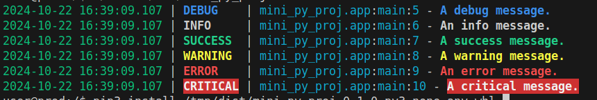

---
tags:
    - python
    - deb
    - wheel
    - package
---

# Python project distribution

Packaging a Python project involves bundling your code, dependencies, and metadata into a distributable format that can be easily installed using Python package managers like pip.

We can pack the project to several formats:
- sdist: source distribution
- bdist: binary distribution

### sdist

Contain project source and instruction how to build and install tha package, it's pack as archive (zip or tar.gz)

```bash
python setup.py sdist
#
# create project tar.gz under dist folder
```

### bdist

It's compile the source if the project depend in none pure python files
it's distribute as `whl` file

```bash
python setup.py bdist_wheel
#
# create whl file under dist folder
```
---

## Demo
Simple python project with dependency (loguru)

```
your_project/
│
├── your_project/
│   ├── __init__.py
│   └── your_code.py
│
├── tests/          (optional)
│   └── test_your_code.py
├── setup.py
├── README.md
```

### setup.py

```python
from setuptools import setup, find_packages

setup(
    name='your_project',             # Name of the package
    version='0.1.0',                 # Version number
    description='A short description of your project',
    long_description=open('README.md').read(),
    long_description_content_type='text/markdown',
    author='Your Name',
    author_email='your.email@example.com',
    packages=find_packages(),        # Automatically find all packages
    include_package_data=True,       # Include non-code files specified in MANIFEST.in
    install_requires=[               # Dependencies (from PyPI)
        'loguru'
    ],
    
    python_requires='>=3.10',         # Specify Python version compatibility
)
```

```python name="app.py"
from loguru import logger

if __name__ == "__main__":
    logger.trace("A trace message.")
    logger.debug("A debug message.")
    logger.info("An info message.")
    logger.success("A success message.")
    logger.warning("A warning message.")
    logger.error("An error message.")
    logger.critical("A critical message.")
```

### Create whl and check

- create docker with python
- Test the whl on this docker

```dockerfile 
FROM ubuntu:22.04

ARG USERNAME=user
ARG USER_UID=1000
ARG USER_GID=$USER_UID

# Create a non-root user
RUN groupadd --gid $USER_GID $USERNAME \
  && useradd -s /bin/bash --uid $USER_UID --gid $USER_GID -m $USERNAME \
  # Add sudo support for the non-root user
  && apt-get update \
  && apt-get install -y sudo \
  && echo $USERNAME ALL=\(root\) NOPASSWD:ALL > /etc/sudoers.d/$USERNAME\
  && chmod 0440 /etc/sudoers.d/$USERNAME \
  && rm -rf /var/lib/apt/lists/*

# Update the package list and install prerequisites
RUN apt-get update && apt-get install -y \
        software-properties-common \
        python3 \
        python3-pip \
        vim \
    && rm -rf /var/lib/apt/lists/*

# Set the default Python3 to be the python command
RUN update-alternatives --install /usr/bin/python python /usr/bin/python3 1
```

```bash
docker build -t python:22.04 -f Dockerfile .
```

```bash
docker run -it --rm \
--hostname prod \
--name prod \
--user user \
-v `pwd`/dist:/tmp/dist \
python:22.04 \
/bin/bash
```

```bash
pip3 install /tmp/dist/mini_py_proj-0.1.0-py3-none-any.whl
```

```bash title="usage"
.local/bin/mini_py_proj
```



---

### Create DEB package for python project

[Build a Debian package(.deb) from your Python program](https://medium.com/@guemandeuhassler96/build-a-debian-package-deb-from-your-python-program-2a3a91e18bbe)

```bash
sudo apt install python3-all debhelper dh-python
```

#### build
!!! note ""
    sdist_dsc build folder for each version
     
```bash title="build deb"
python3 setup.py --command-packages=stdeb.command sdist_dsc

#
cd deb_dist/mini-py-proj-0.1.0

#
dpkg-buildpackage -rfakeroot -uc -us

# -rfakeroot: get root rights

# create deb file in deb_dist folder
```


#### test on docker

```bash
docker run -it --rm \
--hostname prod \
--name prod \
--user user \
-v `pwd`/deb_dist:/tmp/dist python:22.04 \
/bin/bash
```

```bash
sudo apt install /tmp/dist/python3-mini-py-proj_0.1.0-1_all.deb
```
!!! warning "install dependencies"
     
    ```bash
    sudo apt install python3-loguru
    ```

```bash title="run"
./usr/bin/mini_py_proj
```


---

### Add python dependencies into deb package
[Dependency Resolution and Offline Python Package Installation in Linux](https://www.baeldung.com/linux/python-package-offline-installation)


#### install package and all dependencies from local folder
```bash
pip install <PACKAGE>.whl --find-links <DEPENDENCY_PATH> --no-index
```

### Add preinst and postinst


```bash title="check deb file"
dpkg -I deb_dist/python3-mini-py-proj_0.1.0-1_all.deb 
 
 # result
 new Debian package, version 2.0.
 size 2654 bytes: control archive=976 bytes.
     289 bytes,    11 lines      control              
     851 bytes,     9 lines      md5sums              
     275 bytes,    12 lines   *  postinst             #!/bin/sh
     419 bytes,    12 lines   *  prerm                #!/bin/sh
 Package: python3-mini-py-proj
 Source: mini-py-proj
 Version: 0.1.0-1
 Architecture: all
 Maintainer: Your Name <your.email@example.com>
 Installed-Size: 21
 Depends: python3-loguru, python3:any
 Section: python
 Priority: optional
 Description: A short description of your project
```

!!! warning "TODO"
    - embedded whl into deb
     