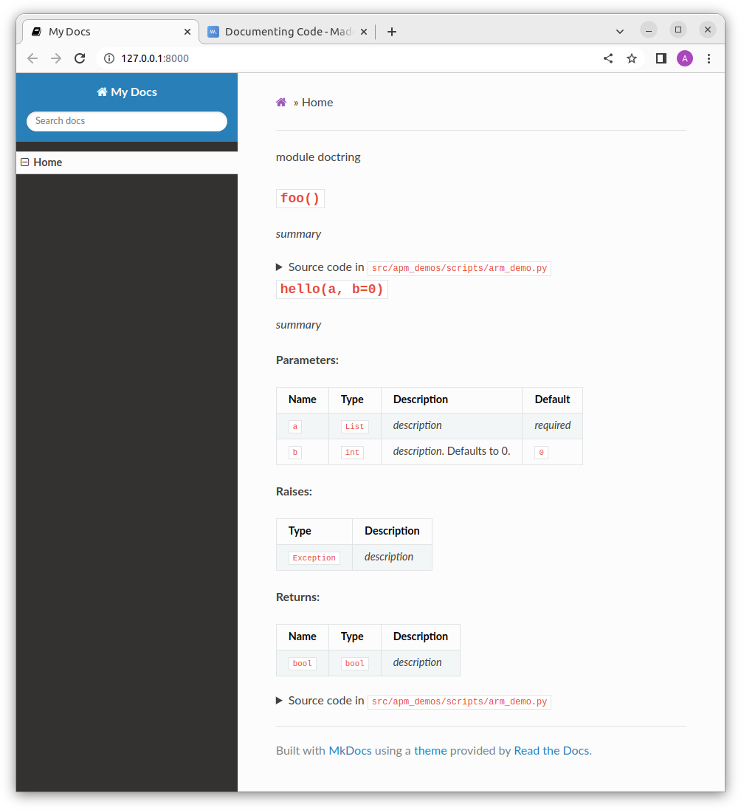

---
tags:
    - python
    - project
    - template
    - docs
    - project document 
    - docstrings
---
# Python project template - docs

## Install
```
pip install mkdocs-material
pip install mkdocstrings
pip install mkdocstrings-python
pip install mkdocs-click
```

## Init docs
- Create `docs` folder
- Create `mkdocs.yml` in project root


```bash
# from project root run
mkdocs new .
```

```yaml title="mkdocs.yml"
site_name: My Docs
theme:
  name: "readthedocs"

plugins:
  - search
  - mkdocstrings

markdown_extensions:
    - mkdocs-click
watch:
  - .  # reload docs for any file changes
```

---

## Simple Demo

```
# Reference

::: my_library.my_module.my_class
```

```md title="index.md"
::: demo_pkg.demo_module
```

```python title="demo_pkg.demo_module"
"""
module doctring
"""
def foo() -> None:
    """_summary_
    """

def hello(a: List, b: int = 0) -> bool:
    """_summary_

    Args:
        a (List): _description_
        b (int, optional): _description_. Defaults to 0.

    Raises:
        Exception: _description_

    Returns:
        bool: _description_
    """
    print(a)
    print(b)
    if b:
        raise Exception("new demo exception")
    return True

```



---

## VSCode
- Install and use autoDocstring extension


---

## Reference
- [mkdocstrings](https://mkdocstrings.github.io/)
- [mkdocstrings usage](https://mkdocstrings.github.io/usage/#usage)