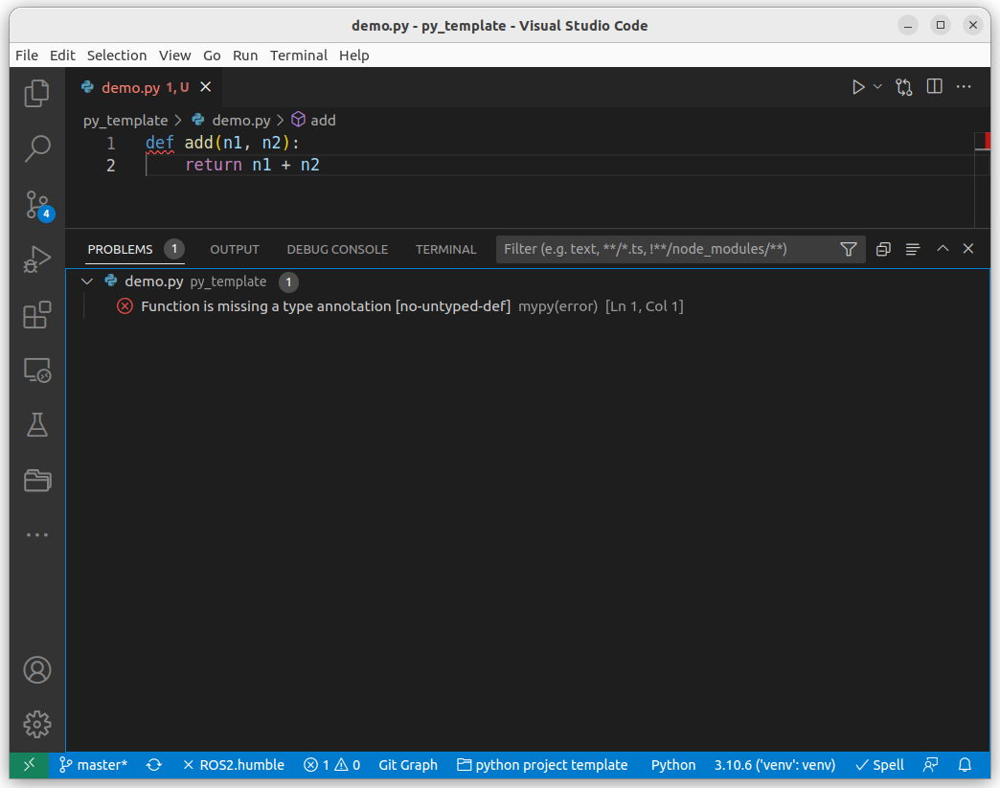

## install
```
pip install mypy
```

## demo

```python title="demo.py"
def func(a, b):
    return a+b

```
## usage
### from cli

```bash title="shell"
mypy demo.py

Success: no issues found in 1 source file

## Strict mode
mypy --strict demo.py

error: Function is missing a type annotation
Found 1 error in 1 file (checked 1 source file)
```

### VSCode
- Enabled mypy
- Set `strict` argument


```json title="settings.json"
"python.linting.mypyEnabled": true
```

#### config
```ini title="pyproject.toml"
[tool.mypy]
strict = true

```

