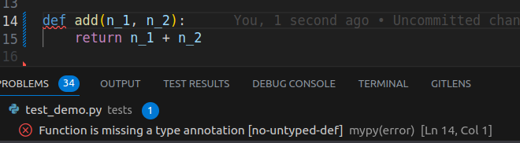

---
tags:
    - mypy
    - python
    - project
    - template
---
# mypy
from [mypy](https://mypy-lang.org/) Mypy is an optional static type checker for Python that aims to combine the benefits of dynamic (or "duck") typing and static typing. Mypy combines the expressive power and convenience of Python with a powerful type system and compile-time type checking.

## install
```
pip install mypy
```

## demo

```python title="demo.py"
def func(a, b):
    return a+b

```
## usage
### from cli

```bash title="shell"
mypy demo.py

Success: no issues found in 1 source file

## Strict mode
mypy --strict demo.py

error: Function is missing a type annotation
Found 1 error in 1 file (checked 1 source file)
```

### VSCode
- Enabled mypy
- Set `strict` argument


```json title="settings.json"
"python.linting.mypyEnabled": true
```

#### config
```ini title="pyproject.toml"
[tool.mypy]
strict = true

```


---

## Tips

### ignore line


!!! note
     Add two spaces between end line and the hash (#)


```python
def add(n1, n2):  # type: ignore
    return n1 + n2
```
