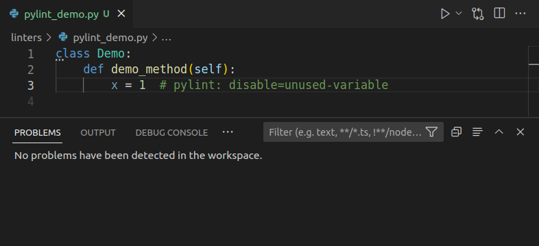

---
tags:
    - python
    - project
    - template
    - pylint
    - linter
    - git-hook
---
# Python project template - pylint

Linting is the automated source code checking for programmatic and stylistic errors.   
A lint tool is a basic static code analyzer

`pylint` is default VSCode linter and it enable by default

## install

```bash title="install"
pip install pylint
```

## VSCode
### Setings

```json title="vscode settings"
"python.linting.pylintEnabled": true
```

### Extensions
[pylint extension for Visual Studio Code](https://marketplace.visualstudio.com/items?itemName=ms-python.pylint)

- Execute pylint automatically on python file
- bundle with pylint can changed by settings `pylint.path`

## Control
control pylint with rules file `.pylintrc`  

`pylintrc` file location

- `/etc/pylintrc`
- `~/pylintrc`
- `<project_path>/pylintrc`


```init title="create pylintrc"
pylint --generate-rcfile > pylintrc
```

!!! note "VSCode"
     VSCode look automaticly for `pylintrc` at the project root

!!! warning "pylintrc"
     pre-commit git hook not found the pylintrc file if we prefix it with dot (`.pylintrc`)

!!! note "VSCode file mapping"
    map `pylintrc` file to ini type
    ```
    "files.associations": {
        "pylintrc": "ini"
    },
    ```

### Demo


minimal `pylintrc` file to disabled checker message

```init
[MASTER]
disable=
    C0114, # (missing-module-docstring)
    C0115,  # (missing-class-docstring)
```

### Demo II
Add rules inline 

- Add comment to end of line
 
```python
# pylint: disable=[problem-code]

# pylint: disable=unused-private-member
```



---

## Run manual

```
~/.local/bin/pylint <file full path>
~/.local/bin/pylint --rcfile=<config_file> <file full path>
```

```bash title="demo"
~/.local/bin/pylint --rcfile pylintrc  pylint_demo.py
************* Module pylint_demo
pylint_demo.py:2:4: R0201: Method could be a function (no-self-use)
pylint_demo.py:1:0: R0903: Too few public methods (1/2) (too-few-public-methods)
```

---

## git hook

- Install pre-commit python util
- Add `.pre-commit-config.yaml`
- Run pre-commit install 
- Add files to `stage`
- Run `pre-commit run` or try commit stage files

```bash title="install"
pip install pre-commit
```

```yaml title=".pre-commit-config.yaml"
repos:
  - repo: local
    hooks:
      - id: pylint
        name: pylint
        entry: pylint
        language: system
        types: [python]
        args: 
            [
            "--rcfile=pylintrc"
            ]

```

### Demo

```bash
 ~/.local/bin/pre-commit run
[WARNING] Unstaged files detected.
[INFO] Stashing unstaged files to /home/user/.cache/pre-commit/patch1681097484-36170.
pylint...................................................................Failed
- hook id: pylint
- exit code: 8

************* Module pylint_demo
linters/pylint_demo.py:1:0: R0903: Too few public methods (1/2) (too-few-public-methods)

-------------------------------------------------------------------
Your code has been rated at 6.67/10 (previous run: 10.00/10, -3.33)


[INFO] Restored changes from /home/user/.cache/pre-commit/patch1681097484-36170.
```

---

## pylintrc template

```ini
[MASTER]
disable=
    C0114, # (missing-module-docstring)
    C0115, # (missing-class-docstring)
    C0116, # (missing-function-docstring)
   
[FORMAT]
# Maximum number of characters on a single line.
max-line-length=120

[BASIC]
# Good variable names which should always be accepted, separated by a comma
good-names=x,y
```

---

## Reference
- [pyline error codes](https://vald-phoenix.github.io/pylint-errors/)
