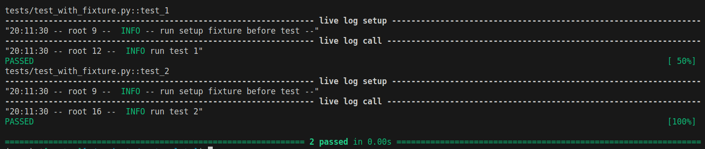
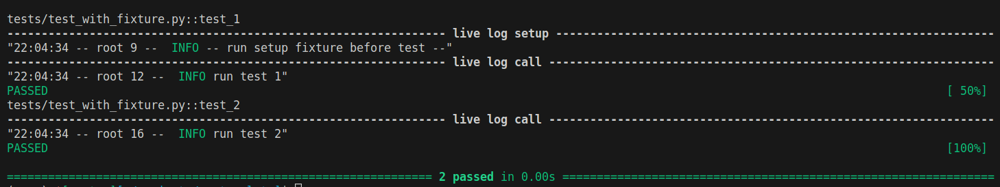
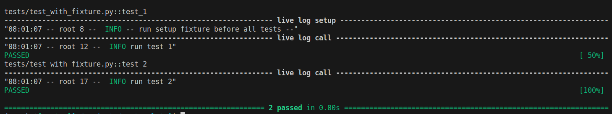
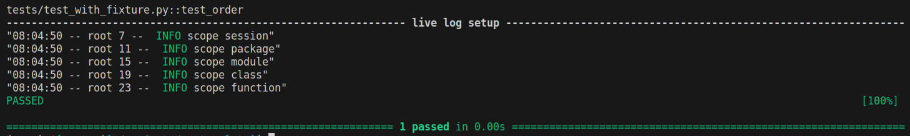

---
tags:
    - pytest
    - unittest
    - python
    - fixture
    - scope
---
# Pytest fixture scope
A test fixture is a piece of software that sets up a system to satisfy certain preconditions of the process

In Pytest we use the fixture function as an input parameter of the test function.

- Function
- Module
- Class
- Session

## pytest.ini
Set logging test capability before run test scope snippets
 
```ini
[pytest]
log_cli = True
log_cli_format = "%(asctime)s -- %(name)s %(lineno)d --  %(levelname)s %(message)s"
log_cli_level = DEBUG
```

## Function scope

```python
import pytest


@pytest.fixture(name="_init")
def setup() -> None:
    logging.info("-- run setup fixture before test --")

def test_1(_init: Callable) -> None:
    logging.info("run test 1")
    assert True

def test_2(_init: Callable) -> None:
    logging.info("run test 2")
    assert True
```

### output


---

## module scope

```python title="module scope" linenums="1" hl_lines="4"
import pytest


@pytest.fixture(name="_init", scope="module")
def setup() -> None:
    logging.info("-- run setup fixture before test --")

def test_1(_init: Callable) -> None:
    logging.info("run test 1")
    assert True

def test_2(_init: Callable) -> None:
    logging.info("run test 2")
    assert True
``` 

### output



---

## Class scope

```python title="class scope" linenums="1" hl_lines="1"
@pytest.fixture(name="_dummy", scope="class")
def dummy_data(request) -> None:
    request.cls.name = "my_name"
    request.cls.age = 50
    logging.info("Execute fixture")


@pytest.mark.usefixtures("_dummy")
class TestCalculatorClass:
    def test_1(self) -> None:
        logging.info(f"Test 1 name: {self.name}")
        assert True

    def test_2(self) -> None:
        logging.info(f"test 2 age:  {self.age}")
        assert True
``` 

### output


---

## Session scope
Fixtures with scope session will only be executed once per session. Every time we run pytest, it’s considered to be one session


```python title="session" linenums="1" hl_lines="6"
import logging
from typing import Callable, Iterator
import pytest


@pytest.fixture(name="_init", scope="session")
def setup() -> None:
    logging.info("-- run setup fixture before all tests --")


def test_1(_init: Callable) -> None:
    logging.info("run test 1")
    assert True


def test_2(_init: Callable) -> None:
    logging.info("run test 2")
    assert True
```

### output



---

## Scope order

```python
import pytest
import logging

@pytest.fixture(scope="session")
def session():
    logging.info("scope session")
    
@pytest.fixture(scope="package")
def package():
    logging.info("scope package")

@pytest.fixture(scope="module")
def module():
    logging.info("scope module")

@pytest.fixture(scope="class")
def class_():
    logging.info("scope class")

@pytest.fixture(scope="function")
def function():
    logging.info("scope function")

def test_order(module, class_, session, function, package):
    assert True
```

### output



---

## Reference
- [Understand 5 Scopes of Pytest Fixtures](https://betterprogramming.pub/understand-5-scopes-of-pytest-fixtures-1b607b5c19ed)