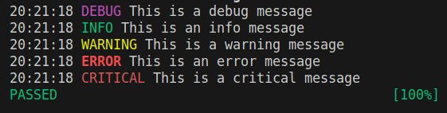

---
tags:
    - pytest
    - unittest
    - python
    - logging
    - pytest.ini
---

# PyTest - logging

```python title="test_demo.py"
import logging

def test_logging():
    logging.debug('This is a debug message')
    logging.info('This is an info message')
    logging.warning('This is a warning message')
    logging.error('This is an error message')
    logging.critical('This is a critical message')
```

```ini title="pytest.ini"
[pytest]
log_cli = True
```

```bash title="run"
pytest
```


## Control format and level

```ini title="pytest.ini"
[pytest]
log_cli = True
log_cli_format = %(asctime)s %(levelname)s %(message)s
log_cli_level = DEBUG
```

