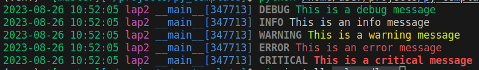

---

tags:
    - python
    - logging
    - logging config
---
# Python Logging

Python has a built-in logging module that provides a simple and flexible way to log events.

The logging module provides four main components:

- **Loggers**: Loggers are responsible for generating log records. They are organized in a hierarchical namespace, with the root logger at the top.
- **Handlers**: Handlers send log records to a destination, such as a file, a database, or the console.
- **Formatters**: Formatters format log records before they are sent to a handler. They can be used to control the appearance of the log records.
- **Filters**: Filters can be used to selectively control which log records are sent to a handler.

## Other Logging examples

- [Add Custom level](custom_level.md)
- [Color log](color_log_by_level.md)

## Demo
### Using json to create logging config

```
├── setup.py
├── test_py
│   ├── app.py
│   ├── __init__.py
│   ├── logging.json
└── venv

```

```json title="logging.json"
{
    "version": 1,
    "disable_existing_loggers": false,
    "handlers": {
      "console": {
        "class": "logging.StreamHandler",
        "level": "DEBUG",
        "formatter": "simple"
      }
    },
    "formatters": {
      "simple": {
        "format": "%(asctime)s - %(name)s - %(levelname)s - %(message)s"
      }
    },
    "loggers": {
      "root": {
        "handlers": ["console"],
        "level": "DEBUG"
      }
    }
  }
  
```

```python title="package/__init__.py"
import logging.config
import pathlib
import json

config_file = pathlib.Path(__file__).parents[0].joinpath("logging.json")
with open(config_file, "r", encoding="utf-8") as f:
    logging_config = json.load(f)

logging.config.dictConfig(logging_config)
```

```python title="app.py"
import test_py  # load code from __init__
import logging

logger = logging.getLogger(__name__)

logger.debug("This is a debug message")
logger.info("This is an info message")
logger.warning("This is a warning message")
logger.error("This is an error message")
logger.critical("This is a critical message")
```

```python title="setup.py"
from setuptools import setup, find_packages

setup(
    name='test_logger',
    version="1.0",
    author='robobe',
    author_email='robobe2020@gmail.com',
    description='test logger init from json',
    packages=find_packages(),
    install_requires=[],
    include_package_data=True,
    entry_points={
        "console_scripts": [
            "app=test_py.app:main"
        ]
    }
)


```

---

## Add console color 

```bash
pip install coloredlogs
```


```python title="add console color" linenums="1" hl_lines="4 12"
import logging.config
import pathlib
import json
import coloredlogs


config_file = pathlib.Path(__file__).parents[0].joinpath("logging.json")
with open(config_file, "r", encoding="utf-8") as f:
    logging_config = json.load(f)

logging.config.dictConfig(logging_config)
coloredlogs.install(level='DEBUG')

```


