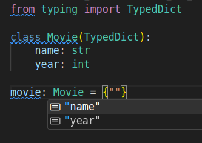

---
tags:
    - python
    - typing
    - typed dict
---
TypedDict describe a structured dictionary/map where the ,
type of each dictionary value depends on the key,
It's allow `mypy` and the `VSCode` to help enforce dictionary structure

```python
from typing import TypedDict

class Movie(TypedDict):
    name: str
    year: int

movie: Movie = {"name": "toy", "year": 1900}
print(type(movie))
d = dict(movie)
print(type(d))
#

```



### total

```python
from typing import TypedDict

class Movie(TypedDict):
    name: str
    year: int

movie: Movie = {"name": "toy"}
```

```txt title="mypy output"
mypy <file to check.py>

...
error: Missing key "year" for TypedDict "Movie"
```

```python
from typing import TypedDict

class Movie(TypedDict, total=False):
    name: str
    year: int

movie: Movie = {"name": "toy"}
```

```txt title="mypy output"

mypy <file to check.py>

Success: no issues found in 1 source file

```

---

## Reference
- ["TypedDict" In Python Is Actually AWESOME!](https://www.youtube.com/watch?v=XSkBFFOtQro)