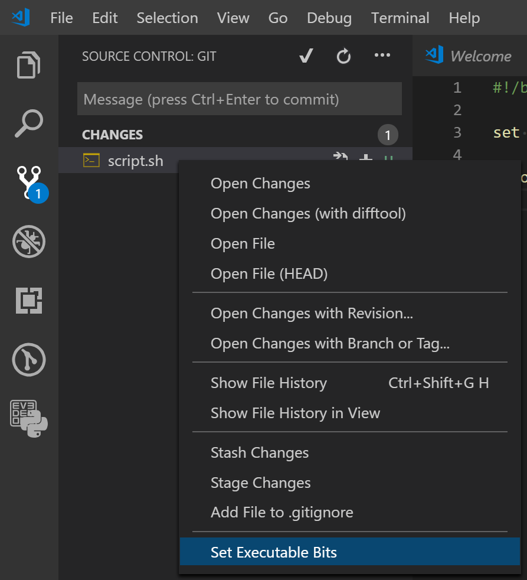

---
tags:
    - ament
    - cmake
    - python
    - ros2
---

# ament_cmake_python

ament_cmake_python is a package that provides CMake functions for packages of the ament_cmake build type that contain Python code.


!!! warning "Don't forget shebang"
     Add python shebang for each python entry

     ```
     #!/usr/bin/env python3
     ```


!!! warning "Change python executable permission"
    For each python entry point set execute permission


!!! tip "vscode context menu file permission
    [dlech.chmod](https://marketplace.visualstudio.com/items?itemName=dlech.chmod)

    ```
    ext install dlech.chmod
    ```

    


## Demo

```
.
└── my_project
    ├── CMakeLists.txt
    ├── package.xml
    └── my_project
        ├── __init__.py
        └── pub.py
```

### package.xml

```
```

### CMakeLists.txt

```bash
find_package(ament_cmake_python REQUIRED)
# ...
ament_python_install_package(${PROJECT_NAME})
```

copy files to project lib folder

```
install(PROGRAMS
  my_project/pub.py
  DESTINATION lib/${PROJECT_NAME}
)
```


### usage

```bash
ros2 run my_project pub.py
```

---

## Reference
- [ament_cmake_python user documentation](https://docs.ros.org/en/jazzy/How-To-Guides/Ament-CMake-Python-Documentation.html)
- [Create a ROS2 package for Both Python and Cpp Nodes](https://roboticsbackend.com/ros2-package-for-both-python-and-cpp-nodes/)