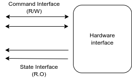

# Ros2_control

## install

```bash
sudo apt install ros-humble-ros2-control
sudo apt install ros-humble-ros2-controllers
sudo apt install ros-humble-gazebo-ros2-control
```

---

## Control manager

## Hardware interface



```bash
ros2 control list_hardware_interfaces
```


## Resource manager
Robot may have multiple hardware interface
The `Resource Manager` gathers all the hardware and expose them all together for the controllers


## Controllers
The controllers loaded by the `Controller Manager` 
The Controller Manager using `yaml` config file to load and config the controllers

!!! note ""
    Two controller can't use the same resource for command interface
    It can use states interface because it R.O 

---

## Controller manager

```
controller_manager/ros2_control_node
```

controller_manager need
- controller config yaml file
- urdf

---

## Gazebo
The urdf contain two parts
- hardware interface
- gazebo plugin

The `gazebo plugins` responsibility
- Talk to hardware
- load and run `controller manager`


---

# Resource
- [#12 - ros2_control Concept & Simulation](https://articulatedrobotics.xyz/mobile-robot-12-ros2-control/)
- [ Using ros2_control to drive our robot (off the edge of the bench...) ](https://youtu.be/4VVrTCnxvSw)
- [12a - ros2_control extra bits](https://articulatedrobotics.xyz/mobile-robot-12a-ros2-control-extra/)
- [ Solving the problem EVERY robot has (with ros2_control) ](https://youtu.be/4QKsDf1c4hc)
- [ You can use ANY hardware with ros2_control ](https://youtu.be/J02jEKawE5U)
- [ros-controls/ros2_control_demos](https://github.com/ros-controls/ros2_control_demos/tree/master)

## HW Interface
- [ ROS2 TUTORIAL. HOW TO RUN ROS2 ON YOUR ROBOT. IMPLEMENTING CUSTOM HARDWARE INTERFACE ](https://youtu.be/be-5DPuDtO8)