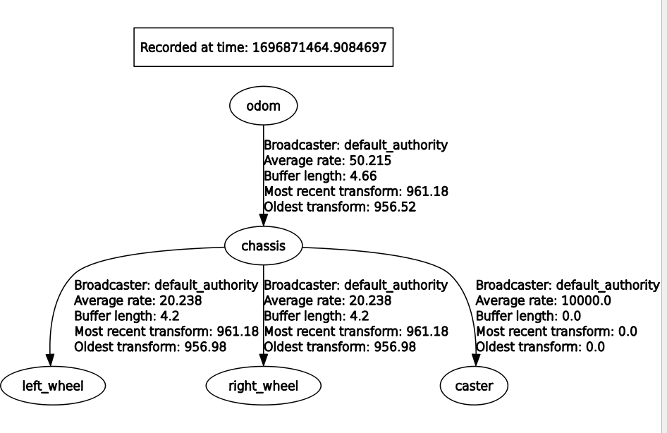

---
tags:
    - ros2
    - ros2_control
    - demo
    - diff-drive
    - gazebo
---

# diff-drive
Control diff-drive using ros2_control and gazebo

## urdf
- add ros2_control tag that define the hardware
- add ros2_control plugin


## ros2_control controllers yaml 

```yaml
controller_manager:
  ros__parameters:
    update_rate: 30
    use_sim_time: true

    diff_cont:
      type: diff_drive_controller/DiffDriveController
    
    joint_broad:
      type: joint_state_broadcaster/JointStateBroadcaster

diff_cont:
  ros__parameters:

    publish_rate: 30.0 # You can set this higher than the controller manager update rate, but it will be throttled
    base_frame_id: base_link

    left_wheel_names: ['wheel_left_joint']
    right_wheel_names: ['wheel_right_joint']
    wheel_separation: 0.32
    wheel_radius: 0.033

    use_stamped_vel: false
```

---

## Gazebo

```xml title="ros2_control.xacro"
<?xml version="1.0"?>
<robot>
    <ros2_control name="GazeboSystem" type="system">
        <hardware>
            <plugin>gazebo_ros2_control/GazeboSystem</plugin>
        </hardware>
        <joint name="wheel_left_joint">
            <command_interface name="velocity">
                <param name="min">-10</param>
                <param name="max">10</param>
            </command_interface>
            <state_interface name="position" />
            <state_interface name="velocity" />
        </joint>
        <joint name="wheel_right_joint">
            <command_interface name="velocity">
                <param name="min">-10</param>
                <param name="max">10</param>
            </command_interface>
            <state_interface name="velocity" />
            <state_interface name="position" />
        </joint>
    </ros2_control>

    <gazebo>
        <plugin filename="libgazebo_ros2_control.so" name="gazebo_ros2_control">
            <parameters>$(find heavy_cart_bringup)/config/controller_manager.yaml</parameters>
        </plugin>
    </gazebo>
</robot>
```

```bash title="gazebo output"
[gazebo_ros2_control]: Loading joint: wheel_left_joint
[gazebo_ros2_control]:       State:
[gazebo_ros2_control]:                position
[gazebo_ros2_control]:                velocity
[gazebo_ros2_control]:       Command:
[gazebo_ros2_control]:                velocity
[gazebo_ros2_control]: Loading joint: wheel_right_joint
[gazebo_ros2_control]:       State:
[gazebo_ros2_control]:                velocity
[gazebo_ros2_control]:                position
[gazebo_ros2_control]:       Command:
[gazebo_ros2_control]:                velocity
[resource_manager]: Initialize hardware 'GazeboSystem' 
[resource_manager]: Successful initialization of hardware 'GazeboSystem'
[resource_manager]: 'configure' hardware 'GazeboSystem' 
[resource_manager]: Successful 'configure' of hardware 'GazeboSystem'
[resource_manager]: 'activate' hardware 'GazeboSystem' 
[resource_manager]: Successful 'activate' of hardware 'GazeboSystem'
[gazebo_ros2_control]: Loading controller_manager
```

```bash
ros2 control list_hardware_interfaces 
#
command interfaces
        wheel_left_joint/velocity [available] [unclaimed]
        wheel_right_joint/velocity [available] [unclaimed]
state interfaces
        wheel_left_joint/position
        wheel_left_joint/velocity
        wheel_right_joint/position
        wheel_right_joint/velocity
```

```bash
ros2 run controller_manager spawner diff_cont
ros2 run controller_manager spawner joint_broad
```

```bash
ros2 control list_hardware_interfaces 
#
command interfaces
        wheel_left_joint/velocity [available] [claimed]
        wheel_right_joint/velocity [available] [claimed]
state interfaces
        wheel_left_joint/position
        wheel_left_joint/velocity
        wheel_right_joint/position
        wheel_right_joint/velocity
```

---

## Demo: Move robot using teleop

```bash
ros2 topic list
#
/clock
/diff_drive_base_controller/cmd_vel_unstamped
/diff_drive_base_controller/odom

```

---

### Run teleop cli

```
sudo apt install ros-humble-teleop-twist-keyboard
```

```bash title="run teleop"
ros2 run teleop_twist_keyboard teleop_twist_keyboard \
--ros-args --remap cmd_vel:=diff_drive_base_controller/cmd_vel_unstamped
```


### Run teleop from launch file

```python title="launch teleop"
import launch
from launch_ros.actions import Node


def generate_launch_description():
    ld = launch.LaunchDescription()
    teleop = Node(
        package="teleop_twist_keyboard",
        executable="teleop_twist_keyboard",
        output='screen',
        name="teleop_demo",
        prefix = 'xterm -e',
        remappings=[
            ('/cmd_vel', '/diff_drive_base_controller/cmd_vel_unstamped'),
        ]
    )


    ld.add_action(teleop)
    return ld
```


---

## tf tree

```bash
ros2 run rqt_tf_tree rqt_tf_tree
```



---

## Controllers
- joint_state_broadcaster
- diff_drive_base_controller

load controllers using `ExecuteProcess`

### Launch 
[check launch file](https://github.com/ros-controls/gz_ros2_control/blob/humble/ign_ros2_control_demos/launch/diff_drive_example.launch.py)

- Using event to trigger action

ignition_spawn_entity --> load_joint_state_controller -->
load_joint_trajectory_controller


```python
from launch.actions import ExecuteProcess

load_joint_trajectory_controller = ExecuteProcess(
    cmd=['ros2', 'control', 'load_controller', '--set-state', 'active',
            'diff_drive_base_controller'],
    output='screen'
)
```

```python
from launch.actions import RegisterEventHandler
from launch.event_handlers import OnProcessExit

RegisterEventHandler(
    event_handler=OnProcessExit(
        target_action=load_joint_state_controller,
        on_exit=[load_joint_trajectory_controller],
    )
),
```

