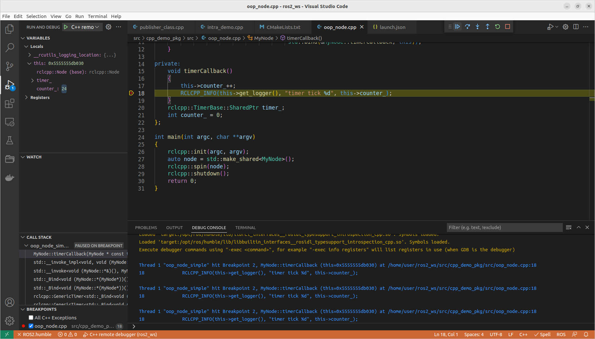

Debug ROS2 cpp node with gdb and gdbserver and vscode

### build

```bash
# set debug flag in CMake file
set(CMAKE_BUILD_TYPE Debug)
#  
set(CMAKE_BUILD_TYPE RelWithDebInfo)

# or from cli

colcon build --symlink-install --cmake-args -DCMAKE_BUILD_TYPE=RelWithDebInfo
```

### Run

```bash
ros2 run --prefix 'gdb --args' package_name executable_name

# example
ros2 run --prefix 'gdb --args' cpp_demo_pkg oop_node_simple
```

### gdb command
```
layout next
l
b main
```


---

### VSCode
set VSCode and gdb as debug server

```bash
ros2 run --prefix 'gdbserver localhost:3000' package_name executable_name

# example
ros2 run --prefix 'gdbserver localhost:3000' cpp_demo_pkg oop_node_simple
```

#### vscode config

```json title="launch.json"
{
    "version": "0.2.0",
    "configurations": [
        {
            "name": "C++ Debugger",
            "request": "launch",
            "type": "cppdbg",
            "miDebuggerServerAddress": "localhost:3000",
            "cwd": "/",
            "program": "[build-path-executable]"
        }
    ]
}
```



---

# Reference
- [How can I run ROS2 nodes in a debugger](https://answers.ros.org/question/267261/how-can-i-run-ros2-nodes-in-a-debugger-eg-gdb/)