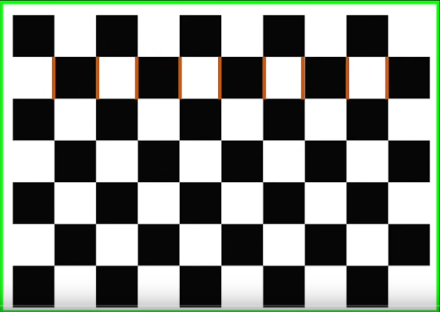
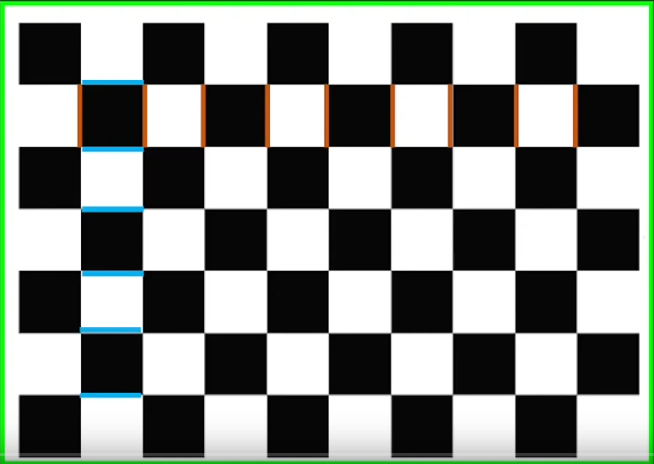

## Dependencies
```
sudo apt install ros-humble-usb-cam

camera_calibration pkg from image-pipeline repository
```

## Checkerboard

- 9*6 Checkerboard
- Count 9 (brown)
- Count 6 (blue)






---

## calibrate

- Run video source
- Run calibration Node


```bash title="usb camera"
ros2 run usb_cam usb_cam_node_exe --ros-args \
-p video_device:=/dev/video4 \
-p image_width:=800 \
-p image_height:=600

```

```
bash title="calibration node"
run camera_calibration cameracalibrator \
--size 8x6 \
--square 0.03 \
--ros-args -r image:=image_raw
```


save data to `/tmp/calibrationdata.tar.gz`

---

# Resource
- [checkerboard-collection](https://markhedleyjones.com/projects/calibration-checkerboard-collection)
- [calibration tutorial](https://github.com/Asadullah-Dal17/Basic-Augmented-reality-course-opencv)