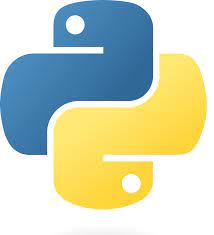

# ROS2 Package 

## from code to deploy

|   |   |   |
|---|---|---|
|   |   |  |

---

# ROS2

Robot Operating System (ROS) is an open-source robotics middleware suite. Although ROS is not an operating system (OS) but a set of software frameworks for robot software development
(wikipedia)

---

# ROS2

1. How to resolve the robotic problem
3. Why of thinking
2. Think only on your's.
9. Standard. Standard. Standard. 
10. Community

---

# ROS2 Framework
5. Nodes / Process
6. Communication (DDS) 
7. Tools (rqt, bag, ..)
8. ECO System (diagnostics, logging, allot of packages)
9. Standard. Standard. Standard. 

---

<!--
 Your speaker notes go here. 
-->

---

# Verbs
- Package
- Nodes
- Topics
  - Pub
  - Sub
  - Service
  - Action
- Parameters
- Messages

---

# Code to Deploy
## let's start
---

# AXE and other tools

"Give me six hours to chop down a tree and I will spend the first four sharpening the axe" 
(Abraham Lincoln)

- Dev environment
  - VSCode

---
# Package from code to deploy

- Requirements analysis
- Design
- Coding

  
---

# Continue ...
- Code quality
  - Tests
  - Linters
  - Static and Dynamic analyze
- Source Control
- Documents
- Package Version
- Deploy
- CI / Maintenance
---

# Language

- Python (3.10)
- CPP (C++17)
- CMAKE
- XML / yaml / json / schema
- BASH
- GIT
- Network
- Physics and Simulation
- Markdown
  
---

# Dev Environment

- GIT
- VSCode
  - Extensions
- ROS2
- Docker
- Network and diagnostic tools

---
# VSCode 

- Python
  - autoDocstring
  - pylint, pylance
- Git
  - Git Graph
  - Git Lance

---

# VSCode more Extensions
- Other
  - xml
  - xml tools
  - yaml
- Helper
  - tabout
  - draw.io
  - project manager
  - Code spell checker

---

# Demo Time
Simple python package from code to deploy

- Requirements and Design
- Code
- Code Quality
- Source Control
- Versioning
- Dependencies
- Deploy
---

# Demo
Optical Flow simple tracker

---

# Design

4 Nodes
- Image source
  - test
  - camera
- Tracker
- Viewer and controller

---

# Topic and messages

---
# Code Quality
### Take time but pay off in the long run

- Type hinting
- Formatters
- Linters
- Test (pytest)
  - unit test
  - integration test
- Commit / Pre-commit
  
---

# Type hinting
Type hint should be use whenever unit test are worth writing

They help you as a developer write better code

---

# Linters
A linter is a tool to help you improve your code

- Fewer errors in production
- Readable, maintainable, consistent code
- Code Style (no endless arguments)
- More secure and performant code

---

# Linters tools
- Pylint
- Flake8
- mypy
  
---

# GIT
- branching strategy 
- commit 
- tag
- merge request

---
# branching strategy

---

# GIT helping tools
- GIT cli
- VSCode
  - Builtin
  - GitLens
  - Git Graph

---

# Thinks that left out

 
- C++
- Cross Compiler
- Simulation
- CI/CD
- Docker and Dev container

