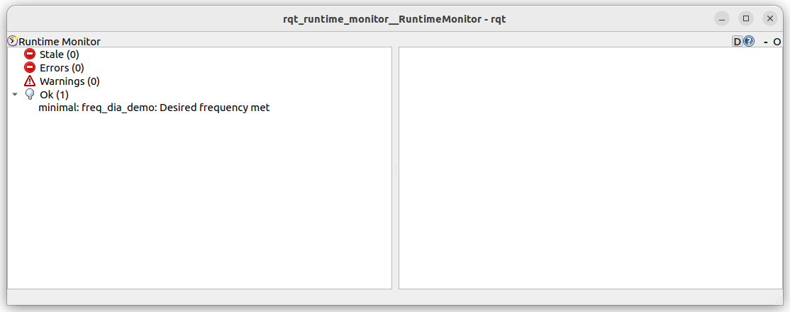
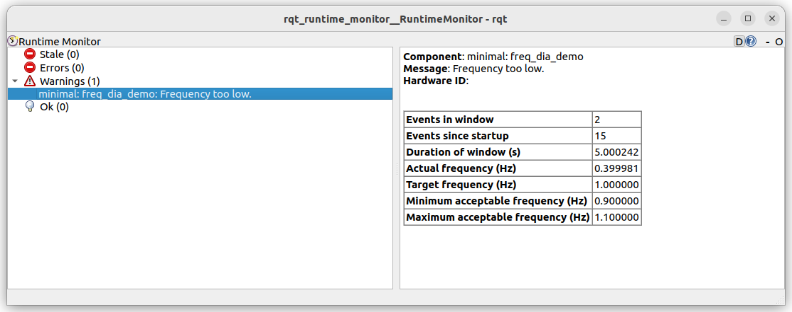

---

tags:
    - ros2
    - rclpy
    - diagnostic
    - tutorials
---

# Using Predefine Tasks

- FrequencyStatus
- TimeStampStatus
- Heartbeat

!!! note "tick and clear method"
     Diagnostic Tasks implementation like `FrequencyStatus` can expose `tick` and `clear`
     For task handling, this methods **not** implement as `abstract` methods in `DiagnosticTask`

## FrequencyStatus
A diagnostic task that monitors the frequency of an event.

tick: Signal that an event has occurred
clear: Reset the statistics


```bash
---
header:
  stamp:
    sec: 1715677850
    nanosec: 1140582
  frame_id: ''
status:
- level: "\0"
  name: 'minimal: freq_dia_demo'
  message: Desired frequency met
  hardware_id: ''
  values:
  - key: Events in window
    value: '5'
  - key: Events since startup
    value: '154'
  - key: Duration of window (s)
    value: '4.999990'
  - key: Actual frequency (Hz)
    value: '1.000002'
  - key: Target frequency (Hz)
    value: '1.000000'
  - key: Minimum acceptable frequency (Hz)
    value: '0.900000'
  - key: Maximum acceptable frequency (Hz)
    value: '1.100000'
---
```



--- 

### Low freq demo

```bash
---
header:
  stamp:
    sec: 1715678014
    nanosec: 971474823
  frame_id: ''
status:
- level: "\x01"
  name: 'minimal: freq_dia_demo'
  message: Frequency too low.
  hardware_id: ''
  values:
  - key: Events in window
    value: '2'
  - key: Events since startup
    value: '64'
  - key: Duration of window (s)
    value: '4.999807'
  - key: Actual frequency (Hz)
    value: '0.400015'
  - key: Target frequency (Hz)
    value: '1.000000'
  - key: Minimum acceptable frequency (Hz)
    value: '0.900000'
  - key: Maximum acceptable frequency (Hz)
    value: '1.100000'
---
```

