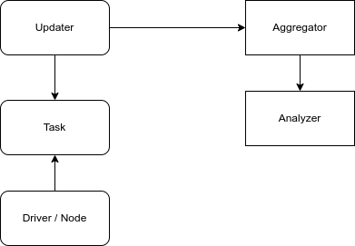

---

tags:
    - ros2
    - diagnostics
    - tutorials
---
# Simple diagnostics demo
## LAB
- Write simple node
  - Add diagnostic task to monitor node state
- Add diagnostic updater and bind the task
- Add diagnostic aggregator
- Show/Monitor  diagnostics data





### Node 

```python title="task_demo" linenums="1" hl_lines="1"
import rclpy
from diagnostic_msgs.msg import DiagnosticStatus
from diagnostic_updater import DiagnosticStatusWrapper, DiagnosticTask, Updater
from rclpy.node import Node


class SimpleDiagnosticsUpdater(Updater):
    def __init__(self, node):
        period = 1
        super().__init__(node, period)
        self.setHardwareID("simple hw")


class DummyTask(DiagnosticTask):
    def __init__(self):
        super().__init__("dummy task")
        self.__monitor_data: int = 0

    def set_data(self, value: int) -> None:
        self.__monitor_data = value

    def run(self, stat: DiagnosticStatusWrapper) -> DiagnosticStatusWrapper:
        status: DiagnosticStatus = DiagnosticStatus.OK
        msg: str = "task ok"
        if (self.__monitor_data % 5) == 0:
            status = DiagnosticStatus.WARN
            msg = "task warning"
        if (self.__monitor_data % 10) == 0:
            status = DiagnosticStatus.ERROR
            msg = "task error"
        stat.summary(status, msg)
        return stat


class MyNode(Node):
    def __init__(self):
        node_name = "simple"
        super().__init__(node_name)
        self.__init_diagnostics()
        self.__data_to_monitor = 0
        self.create_timer(1.0, self.__timer_handler)
        self.get_logger().info("Hello ROS2")

    def __init_diagnostics(self) -> None:
        self.diagnostics_updater = SimpleDiagnosticsUpdater(self)
        self.dummy_task = DummyTask()
        self.diagnostics_updater.add(self.dummy_task)

    def __timer_handler(self):
        self.__data_to_monitor += 1
        self.dummy_task.set_data(self.__data_to_monitor)
        self.diagnostics_updater.update()


def main(args=None):
    rclpy.init(args=args)
    node = MyNode()
    try:
        rclpy.spin(node)
    except KeyboardInterrupt:
        print("User exit")
    finally:
        node.destroy_node()
        rclpy.try_shutdown()


if __name__ == "__main__":
    main()
``` 

---

### Aggregator config
```python title="diagnostics_aggregator_config" linenums="1" hl_lines="1"
analyzers:
  ros__parameters:
    path: Sensors
    primary:
      type: 'diagnostic_aggregator/AnalyzerGroup'
      path: Demo_group
      analyzers:
        primary:
          type: 'diagnostic_aggregator/GenericAnalyzer'
          path: simple_path_demo
          contains: ["dummy task"]
```

---

### launch
```python title="demo.launch.py"
import os

from ament_index_python.packages import get_package_share_directory
from launch import LaunchDescription
from launch.actions import ExecuteProcess
from launch_ros.actions import Node

PACKAGE = "diagnostics_tutorial"


def generate_launch_description():
    ld = LaunchDescription()

    config = os.path.join(
        get_package_share_directory(PACKAGE),
        "config",
        "diagnostics_aggregator_config.yaml",
    )

    simple_node = Node(package=PACKAGE, executable="task")

    agg_node = ExecuteProcess(
        cmd=[
            "ros2",
            "run",
            "diagnostic_aggregator",
            "aggregator_node",
            "--ros-args",
            "--params-file",
            config,
        ],
        name="aggregator_node",
        emulate_tty=True,
        output="screen",
    )

    robot_monitor = Node(package="rqt_robot_monitor", executable="rqt_robot_monitor")

    runtime_monitor = Node(
        package="rqt_runtime_monitor", executable="rqt_runtime_monitor"
    )

    ld.add_action(simple_node)
    ld.add_action(agg_node)
    ld.add_action(robot_monitor)
    ld.add_action(runtime_monitor)
    return ld

```

### Show Diagnostics
- rqt_runtime_monitor (right)
- rqt_robot_monitor (left)


!!!
    messages show in Tree view by `path` attribute in each level


