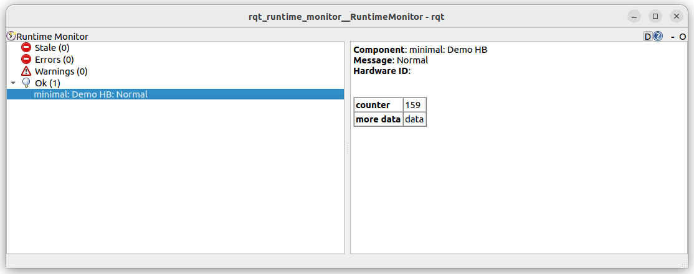

---
tags:
    - ros2
    - rclpy
    - diagnostic
    - tutorials
---
# Diagnostic Task Demo

Diagnostic minimal implementation for Node


### Minimal diagnostic demo
- Implement **diagnostic task** class inherit from `DiagnosticTask`
- Override `run` method
- Create Updater
  - Assign the task 

```python title="minimal diagnostic"
import rclpy
from rclpy.node import Node
from diagnostic_msgs.msg import DiagnosticStatus
from diagnostic_updater import (
    DiagnosticTask, 
    DiagnosticStatusWrapper, 
    Updater
)

class HeartbeatStatus(DiagnosticTask):
    def __init__(self, name):
        super().__init__(name)
        

    def run(self, stat: DiagnosticStatusWrapper):
        stat.summary(DiagnosticStatus.OK, "Normal")
        return stat

class MyNode(Node):
    def __init__(self):
        node_name="minimal"
        super().__init__(node_name)
        # Create updater, run all diagnostic tasks and
        # pub tasks outputs as DiagnosticArray msg into '/diagnostics' topic
        self.dia_updater = Updater(self)
        self.hb_diag = HeartbeatStatus("Demo HB")
        self.dia_updater.add(self.hb_diag)


    

def main(args=None):
    rclpy.init(args=args)
    node = MyNode()
    rclpy.spin(node)
    node.destroy_node()
    rclpy.shutdown()

if __name__ == '__main__':
    main()
```


```bash title="diagnostic topic"
ros2 topic echo /diagnostics

#
---
header:
  stamp:
    sec: 1715659184
    nanosec: 483321181
  frame_id: ''
status:
- level: "\0"
  name: 'minimal: Demo HB'
  message: Normal
  hardware_id: ''
  values: []
---
```


---

### Add more information 
Add key value information to Diagnostic task / message

```python
import rclpy
from rclpy.node import Node
from diagnostic_msgs.msg import DiagnosticStatus
from diagnostic_updater import (
    DiagnosticTask, 
    DiagnosticStatusWrapper, 
    Updater
)

class HeartbeatStatus(DiagnosticTask):
    def __init__(self, name):
        super().__init__(name)
        self.counter = 0


    def run(self, stat: DiagnosticStatusWrapper):
        stat.summary(DiagnosticStatus.OK, "Normal")
            
        stat.add("counter", str(self.counter))
        self.counter += 1
        stat.add("more data", "data")
        return stat

class MyNode(Node):
    def __init__(self):
        node_name="minimal"
        super().__init__(node_name)
        self.dia_updater = Updater(self, period=0.5)
        self.hb_diag = HeartbeatStatus("Demo HB")
        self.dia_updater.add(self.hb_diag)

    

def main(args=None):
    rclpy.init(args=args)
    node = MyNode()
    rclpy.spin(node)
    node.destroy_node()
    rclpy.shutdown()

if __name__ == '__main__':
    main()
```


```bash
ros2 topic echo /diagnostics

#

---
header:
  stamp:
    sec: 1715660579
    nanosec: 436707640
  frame_id: ''
status:
- level: "\0"
  name: 'minimal: Demo HB'
  message: Normal
  hardware_id: ''
  values:
  - key: counter
    value: '19'
  - key: more data
    value: data
---
```

