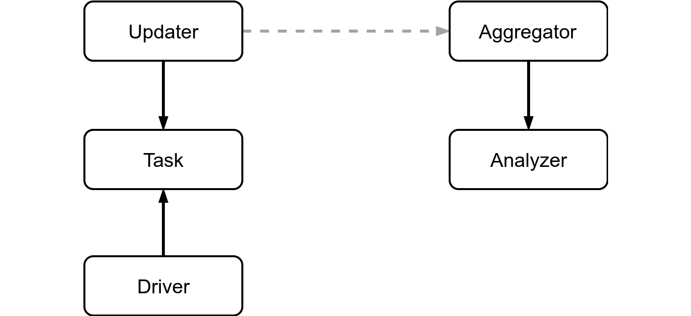
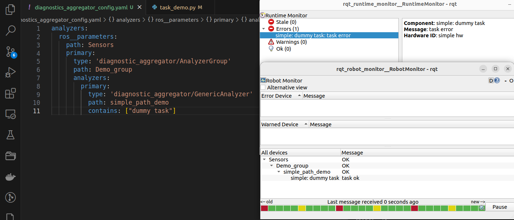

---
tags:
    - diagnostic
    - DiagnosticTask
---
# ROS2 diagnostic

ROS diagnostics gives you the ability to monitor your system. There are two components in its architecture:

- **updater**
- **aggregator**
  
  The **updater** publishes diagnostic status messages on the `/diagnostics` topic, and the **aggregator** listens to these statuses, aggregates them, and publishes the results on the `/diagnostics_agg` topic.

A system can have multiple updaters. They are meant to communicate with devices such as motors, sensors, computers, batteries, etc, in order to retrieve and publish relevant status data. The information being published on the /diagnostics topic is flat  

The aggregator collects, categorizes, and groups the statuses from all the system components. You can take a look at what is being published on the /diagnostics and /diagnostics_agg topics with the rqt_runtime_monitor and rqt_robot_monitor tools


### DiagnosticTask
DiagnosticTask is an abstract base class for collecting diagnostic data. 

A DiagnosticTask has a name, and a function that is called to create a DiagnosticStatusWrapper. 

DiagnosticsTask subclass by

- CompositeDiagnosticTask
- FrequencyStatus
- GenericFunctionDiagnosticTask
- Heartbeat
- TimeStampStatus


### diagnostic_aggregator
Aggregator is a node that subscribes to `/diagnostics`, processes it and republishes aggregated data on `/diagnostics_agg`.

The aggregator creates a series of analyzers to handle incoming `DiagnosticStatus`

[API](https://docs.ros.org/en/humble/p/diagnostic_aggregator/generated/classdiagnostic__aggregator_1_1Aggregator.html#class-documentation)





### diagnostics viewers
```bash title="install"
sudo apt install ros-humble-rqt-robot-monitor
sudo apt install ros-humble-rqt-runtime-monitor
```

---



---


# Reference
- [REP-107 Diagnostic System for Robots Running ROS](https://www.ros.org/reps/rep-0107.html)
- [ros diagnostic](https://nlamprian.me/blog/software/ros/2018/03/21/ros-diagnostics/)
- [wiki](https://wiki.ros.org/diagnostics)
- [python example](http://docs.ros.org/en/jade/api/diagnostic_updater/html/example_8py_source.html)
### projects to check
- [rviz_2d_overlay_plugins](https://github.com/teamspatzenhirn/rviz_2d_overlay_plugins))

