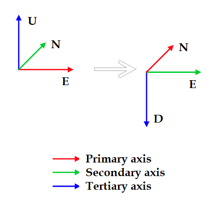

---
tags:
    - ned
    - enu
    - ros
    - mavros
    - coordinate
---

$$
 P_{ned} = P_{enu}= \begin{bmatrix}
 0&  1& 0 \\
 1&  0&  0\\
 0&  0& -1 \\
\end{bmatrix} 
\begin{bmatrix}
 P_x&  \\
 P_y&  \\
 P_z&  \\
\end{bmatrix} 
=\begin{bmatrix}
 P_y&  \\
 P_x&  \\
 -P_z&  \\
\end{bmatrix} 
$$

## Reference
- [ENU -> NED frame conversion using quaternions](https://stackoverflow.com/questions/49790453/enu-ned-frame-conversion-using-quaternions)
- [Visualizing quaternionsquaternions](https://eater.net/quaternions)