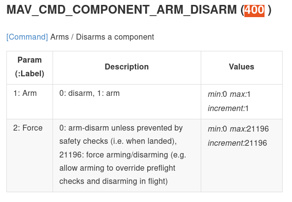

## Objective
- Run copter SITL
- connect with mavros
- work with: call service , get info
- understand the code (arming for example)
---

## Usage

```bash title="terminal1"
# Run SITL with mavproxy
# mavproxy connect to port tcp 5760 and output udp to port 14550
cd ardupilot
cd ArduCopter
../Tools/autotest/sim_vehicle.py
```

```bash title="terminal2"
# run mavros
ros2 run mavros mavros_node --ros-args -p fcu_url:=udp://localhost:14550@
```

```bash title="terminal3"
ros2 topic echo /mavros/state
#
---
header:
  stamp:
    sec: 1665044282
    nanosec: 30902710
  frame_id: ''
connected: true
armed: false
guided: true
manual_input: true
mode: GUIDED
system_status: 3
---
```

#### arming
```bash
## search for arming service
ros2 service list | grep arm
/mavros/cmd/arming

## get more info about the service
ros2 service type /mavros/cmd/arming
mavros_msgs/srv/CommandBool

## show message info
ros2 interface show mavros_msgs/srv/CommandBool
# Common type for switch commands

bool value
---
bool success
uint8 result

## cal the service
ros2 service call /mavros/cmd/arming mavros_msgs/srv/CommandBool "{value: True}"
requester: making request: mavros_msgs.srv.CommandBool_Request(value=True)

response:
mavros_msgs.srv.CommandBool_Response(success=True, result=0)
```

---

## check the code




```cpp title="command.cpp"
arming_srv =
      node->create_service<mavros_msgs::srv::CommandBool>(
      "~/arming",
      std::bind(
        &CommandPlugin::arming_cb, this, _1, _2,
        _3), rmw_qos_profile_services_default, srv_cg);

...

void arming_cb(
    const std::shared_ptr<rmw_request_id_t> req_header [[maybe_unused]],
    const mavros_msgs::srv::CommandBool::Request::SharedPtr req,
    mavros_msgs::srv::CommandBool::Response::SharedPtr res)
  {
    using mavlink::common::MAV_CMD;
    send_command_long_and_wait(
      false,
      enum_value(MAV_CMD::COMPONENT_ARM_DISARM), 1,
      (req->value) ? 1.0 : 0.0,
      0, 0, 0, 0, 0, 0,
      res->success, res->result);
  }
```