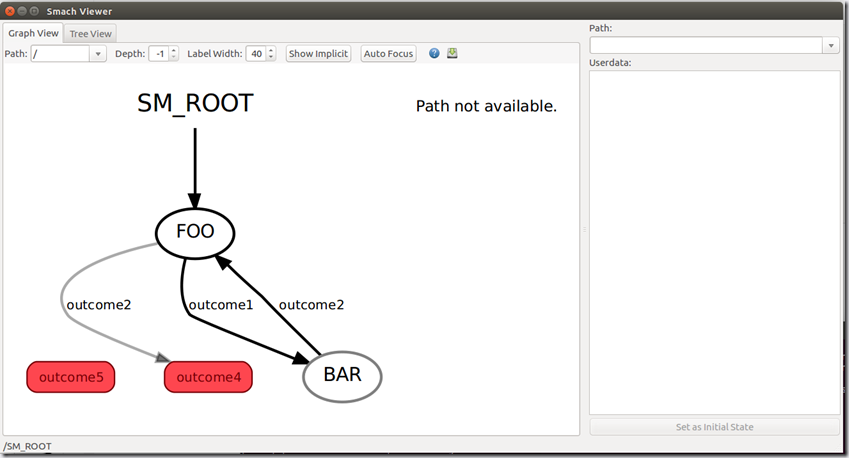

---
tags:
    - smach
    - state machine
    - ros2
---

```
sudo apt install ros-humble-smach-ros
```

## smach visualization
- Clone [project](https://github.com/DeepX-inc/executive_smach_visualization)
- Install dependencies
- Build using colcon

!!! note "clone"
    Clone fox-devel branch in build ok with humble version
     

## Demo 
Simple state machine
- Using smach_viewer

```python
import rclpy
from rclpy.node import Node
import smach
import smach_ros
import time


log = rclpy.logging.get_logger(__name__)

class Foo(smach.State):
    def __init__(self):
        super().__init__(outcomes=["outcome1", "outcome2"])
        self.counter = 0

    def execute(self, ud):
        time.sleep(1)       # todo: how to sleep in ros
        if self.counter < 10:
            self.counter += 1
            return "outcome1"
        else:
            return "outcome2"
        
class Bar(smach.State):
    def __init__(self):
        super().__init__(outcomes=["outcome2"])

    def execute(self, ud):
        # log.info("--------------------")        
        time.sleep(1)
        return "outcome2"
    
class MyNode(Node):
    def __init__(self):
        node_name="smach_sm"
        super().__init__(node_name)
        self.get_logger().info("Hello ROS2 smach")

        self.sm = smach.StateMachine(outcomes=["outcome4", "outcome5"])

        with self.sm:
            smach.StateMachine.add("FOO", Foo(), transitions={"outcome1": "BAR", "outcome2": "outcome4"})
            smach.StateMachine.add("BAR", Bar(), transitions={"outcome2": "FOO" })

        
        self.sis = smach_ros.IntrospectionServer("my_smach_introspection_server", self.sm, "/SM_ROOT")
        self.sis.start()
        outcome = self.sm.execute()

    def close(self):
        self.sis.stop()

def main(args=None):
    rclpy.init(args=args)
    node = MyNode()
    
    try:
        
        rclpy.spin(node)
    except KeyboardInterrupt:
        print("User exit")
    finally:
        node.close()
        node.destroy_node()
        rclpy.try_shutdown()

if __name__ == '__main__':
    main()
```

### Run

```bash title="terminal1"
ros2 run smach_viewer smach_viewer_gui.py
```

```bash title="terminal2"
ros2 run smach_viewer smach_viewer_gui.py
```



---

## State machine
State machine at last contains two states

- State: 
- Event
- Action
- Transition: Changing from one state to another
- 

### State
- Inherit from `smach.State`
- Define possible **outcomes**
- Implement **Action** in execute method
  
```python
class Bar(smach.State):
    def __init__(self):
        super().__init__(outcomes=["outcome2"])

    def execute(self, ud):
        return "outcome2"

```
---

### State Machine
- Define state machine
- The statemachine has two **output** options after it execute

```python
self.sm = smach.StateMachine(outcomes=["outcome4", "outcome5"])
```

- The statemachine is a container for states
- Add state and mapping the state outcomes to another states.

```python
with self.sm:
    smach.StateMachine.add("FOO", Foo(), transitions={"outcome1": "BAR", "outcome2": "outcome4"})
    smach.StateMachine.add("BAR", Bar(), transitions={"outcome2": "FOO" })
```
---

## Reference
- [executive_smach](https://github.com/ros/executive_smach)
- [ROS2 Smach](https://blog.csdn.net/qq_43557907/article/details/125997699)
- [executive smach visualization](https://github.com/DeepX-inc/executive_smach_visualization)