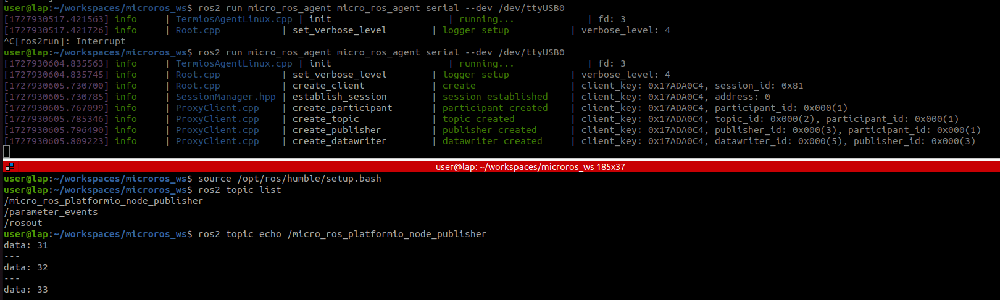

---
tags:
    - ros2
    - micro_ros
    - embedded
    - 
---

# Micro ROS
Build micro ros hello world with vscode and platformio using esp32 hardware

## create platformio project

```bash
mkdir micro_ros_demo
pio project init -d micro_ros_demo
```

```
# check for connected devices
pio device list
pio boards | grep esp32


```

### settings
- Add micro_ros library
- config ros distro to humble
- config transport to serial

```ini title="platformio.ini"
[env:esp32dev]
platform = espressif32
board = esp32dev
framework = arduino
board_microros_distro = humble
board_microros_transport = serial

lib_deps =
    https://github.com/micro-ROS/micro_ros_platformio
```

### demo code
Micro ros - rclc

- support: function and structure for ROS2 types
- executer
- allocator
- nodes

copy example from [micro_ros_platformio/examples/micro-ros_publisher/src/main.cpp](https://github.com/micro-ROS/micro_ros_platformio/blob/main/examples/micro-ros_publisher/src/Main.cpp)


---

### Agent

[First micro-ROS Application on Linux](https://micro.ros.org/docs/tutorials/core/first_application_linux/)


#### Install

##### microros workspace
```bash
# Source the ROS 2 installation
source /opt/ros/$ROS_DISTRO/setup.bash

# Create a workspace and download the micro-ROS tools
mkdir microros_ws
cd microros_ws
git clone -b $ROS_DISTRO https://github.com/micro-ROS/micro_ros_setup.git src/micro_ros_setup

# Update dependencies using rosdep
sudo apt update && rosdep update
rosdep install --from-paths src --ignore-src -y

# Install pip
sudo apt-get install python3-pip

# Build micro-ROS tools and source them
colcon build
source install/local_setup.bash
```

##### Create and build agent
```
ros2 run micro_ros_setup create_agent_ws.sh
ros2 run micro_ros_setup build_agent.sh
source install/setup.bash
```

#### Run
```bash
ros2 run micro_ros_agent micro_ros_agent serial --dev /dev/ttyUSB0
```



---

## Reference
- [Micro-Ros robot using PlatformIO for esp32 for ROS2](https://youtu.be/Nf7HP9y6Ovo)
- [micro_ros_platformio](https://github.com/micro-ROS/micro_ros_platformio)