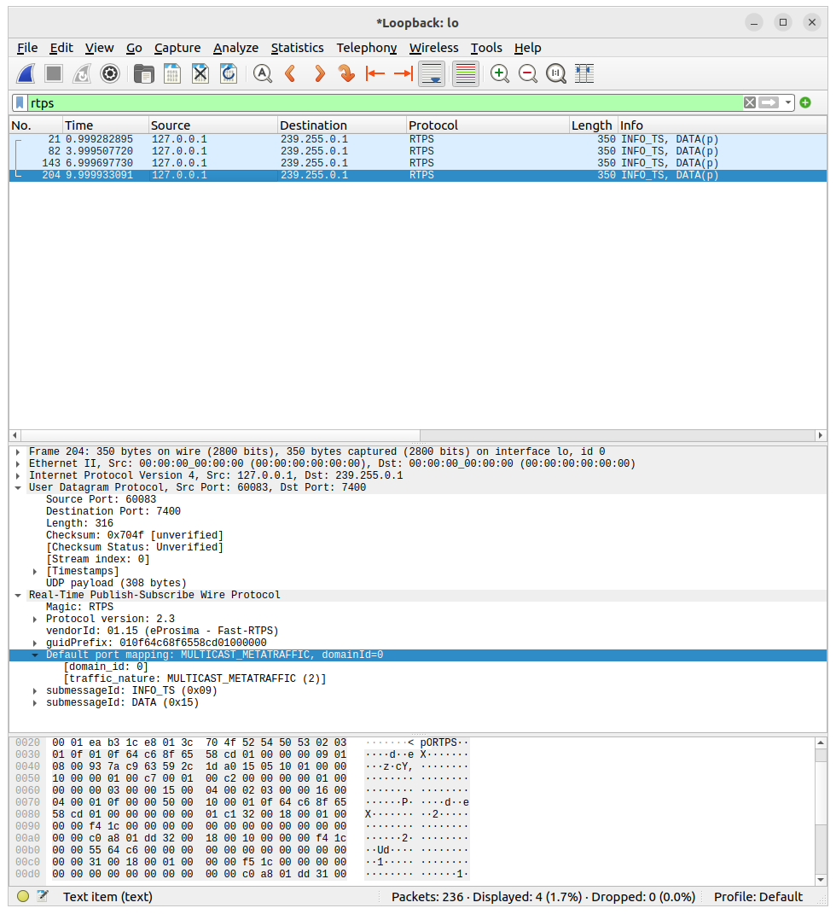
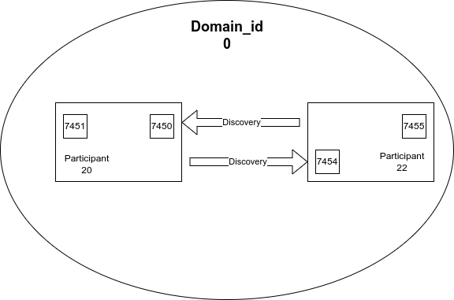
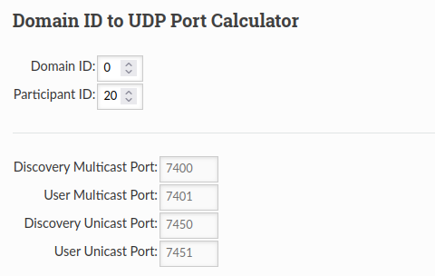
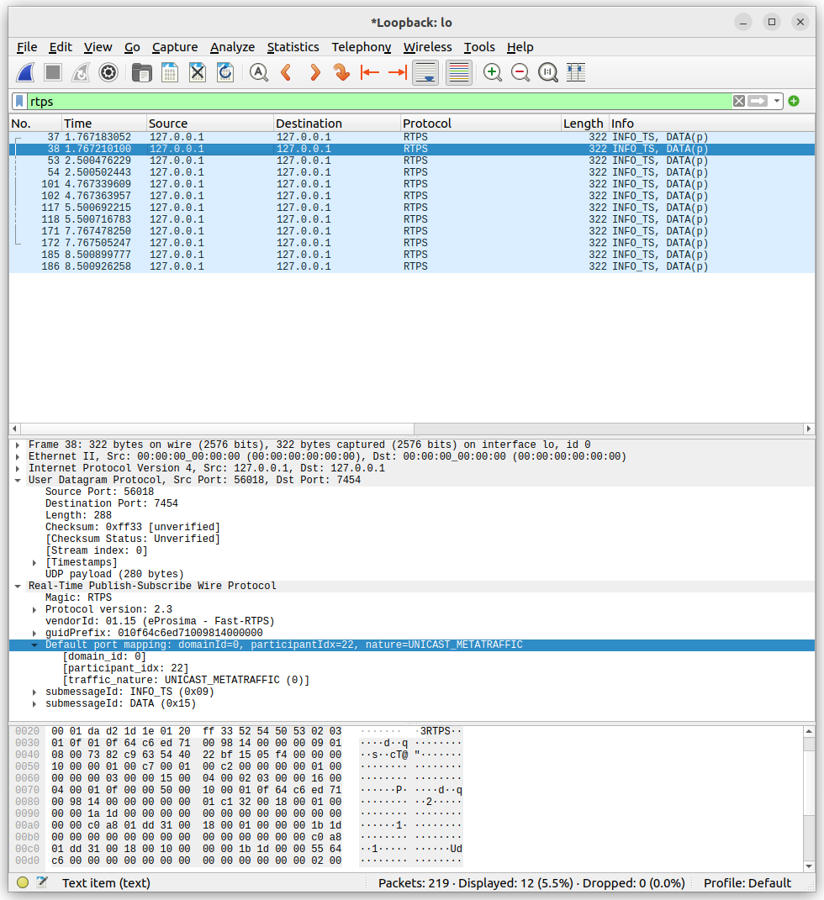

# Objective
- Show ROS node normal discovery behavior
- Unicast discovery: Set Node discovery protocol to **unicast**


For each ROS 2 process running on a computer, one DDS “participant” is created
Each DDS participant takes up two `unicast` ports on the computer.

- Discovery Unicast port: for discovery / meta-traffic
- User Unicast port: for user traffic port
## ROS2 Node demo
- Run Pub/Sub nodes
  - Check open ports
  - Analyze discovery data with wireshark 

!!! note "Domain_ID"
    Nodes run on domain 0
  


```bash title="usage"
ros2 run demo_nodes_cpp talker
```

```bash
sudo lsof -i -P -n | grep UDP | grep talker
#
talker    877967            user    9u  IPv4 72699380      0t0  UDP *:7400 
talker    877967            user   10u  IPv4 72699382      0t0  UDP *:7412 
talker    877967            user   12u  IPv4 72699383      0t0  UDP *:7413 
talker    877967            user   14u  IPv4 72699385      0t0  UDP *:60083
```



The Node/Participant publish **multicast** discovery data each 3 sec, on port `7400`


### Multiple node

```bash  title="terminal1"
ros2 run demo_nodes_cpp talker
```

```bash title="terminal2"
ros2 run demo_nodes_cpp listener
```

!!! note "multiple node"
    if we run more the one node, each of them send **multicast** discovery data on the the domain port `7400`

     
```bash title="lsof" linenums="1" hl_lines="1 6"
sudo lsof -i -P -n | grep UDP | grep 'list\|talker' 
talker    883188            user    9u  IPv4 72872989      0t0  UDP *:7400 
talker    883188            user   10u  IPv4 72872991      0t0  UDP *:7412 
talker    883188            user   12u  IPv4 72872992      0t0  UDP *:7413 
talker    883188            user   14u  IPv4 72872994      0t0  UDP *:34513 
talker    883188            user   15u  IPv4 72872995      0t0  UDP 192.168.1.221:35422 
listener  883200            user    9u  IPv4 72864737      0t0  UDP *:7400 
listener  883200            user   10u  IPv4 72864740      0t0  UDP *:7414 
listener  883200            user   12u  IPv4 72864742      0t0  UDP *:7415 
listener  883200            user   14u  IPv4 72864744      0t0  UDP *:37961 
listener  883200            user   15u  IPv4 72864745      0t0  UDP 192.168.1.221:43254 
```

---

## Disabled multicast discovery 
To disabled multicast discovery data we need to use fastdds custom profile,  
We set the profile by `FASTRTPS_DEFAULT_PROFILES_FILE` environment variable that point to the profile file

!!! note ""
    - The profile disabled multicast discovery
    - Set Node sending discovery **unicast** data to it's config peers

```bash title="usage demo"
export FASTRTPS_DEFAULT_PROFILES_FILE="$(pwd)/STATIC_profile.xml"
ros2 run demo_nodes_cpp talker
```

### demo
#### Run Pub/Talker



To disabled Node/Participant we need to tale the node where to find the other peer

- Start nodes on domain_id=0
- Set the Publisher/Talker node participant number to 20
- Set the Subscriber/Listener peer node participant number to 22





```xml title="STATIC_PROFILE_W.xml"
<?xml version="1.0" encoding="UTF-8" ?>
<profiles xmlns="http://www.eprosima.com/XMLSchemas/fastRTPS_Profiles">
    <participant profile_name="disable_multicast" is_default_profile="true">
        <rtps>
            <participantID>20</participantID>
            <builtin>
                <metatrafficUnicastLocatorList>
                    <locator/>
                </metatrafficUnicastLocatorList>
                <initialPeersList>
                    <locator>
                        <udpv4>
                            <address>127.0.0.1</address>
                            <port>7454</port>
                        </udpv4>
                    </locator>
                </initialPeersList>
            </builtin>
        </rtps>
    </participant>
</profiles>
```

```bash title="terminal1"
source /opt/ros/humble/setup.bash
export FASTRTPS_DEFAULT_PROFILES_FILE="$(pwd)/STATIC_PROFILE_W.xml"
ros2 run demo_nodes_cpp talker
```

```
sudo lsof -i -P -n | grep UDP | grep 'list\|talker'
talker    881133            user    9u  IPv4 72808683      0t0  UDP *:7450 
talker    881133            user   10u  IPv4 72808684      0t0  UDP *:7451 
talker    881133            user   12u  IPv4 72808686      0t0  UDP *:56018
```

!!! note ""
     We can see that no multicast domain is open, and the node open ports `7450, 7451` according to the domain port calculator


```bash title="terminal2"
source /opt/ros/humble/setup.bash
export FASTRTPS_DEFAULT_PROFILES_FILE="$(pwd)/STATIC_PROFILE_R.xml"
ros2 run demo_nodes_cpp listener
```


!!! note ""
     The node send its discovery data to other peer declare at the xml profile in 3 sec interval

     for know the peer not running and we got `icmp` port unreachable message


#### Running both node



- Both node send discovery data in 3 sec interval to each other

```bash
sudo lsof -i -P -n | grep UDP | grep 'list\|talker'
talker    881133            user    9u  IPv4 72808683      0t0  UDP *:7450 
talker    881133            user   10u  IPv4 72808684      0t0  UDP *:7451 
talker    881133            user   12u  IPv4 72808686      0t0  UDP *:56018 
talker    881133            user   13u  IPv4 72808687      0t0  UDP 192.168.1.221:42527 
listener  881878            user    9u  IPv4 72822584      0t0  UDP *:7454 
listener  881878            user   10u  IPv4 72822585      0t0  UDP *:7455 
listener  881878            user   12u  IPv4 72822587      0t0  UDP *:51421 
listener  881878            user   13u  IPv4 72822588      0t0  UDP 192.168.1.221:52642 
```


### Profiles
#### Publisher/Talker

```xml title="STATIC_PROFILE_W.xml"
<?xml version="1.0" encoding="UTF-8" ?>
<profiles xmlns="http://www.eprosima.com/XMLSchemas/fastRTPS_Profiles">
    <participant profile_name="disable_multicast" is_default_profile="true">
        <rtps>
            <participantID>20</participantID>
            <builtin>
                
                <metatrafficUnicastLocatorList>
                    <locator/>
                </metatrafficUnicastLocatorList>
                <initialPeersList>
                    <locator>
                        <udpv4>
                            <address>127.0.0.1</address>
                            <port>7454</port>
                        </udpv4>
                    </locator>
                </initialPeersList>
            </builtin>
        </rtps>
    </participant>
</profiles>
```

#### Subscriber/Listener

```xml title="STATIC_PROFILE_R.xml"
<?xml version="1.0" encoding="UTF-8" ?>
<profiles xmlns="http://www.eprosima.com/XMLSchemas/fastRTPS_Profiles">
    <participant profile_name="disable_multicast" is_default_profile="true">
        <rtps>
            <participantID>22</participantID>
            <builtin>
                <metatrafficUnicastLocatorList>
                    <locator/>
                </metatrafficUnicastLocatorList>
                <initialPeersList>
                    <locator>
                        <udpv4>
                            <address>127.0.0.1</address>
                            <port>7450</port>
                        </udpv4>
                    </locator>
                </initialPeersList>
            </builtin>
        </rtps>
    </participant>
</profiles>
```

---

# Reference
- [fast-dds discovery](https://fast-dds.docs.eprosima.com/en/latest/fastdds/discovery/discovery.html)