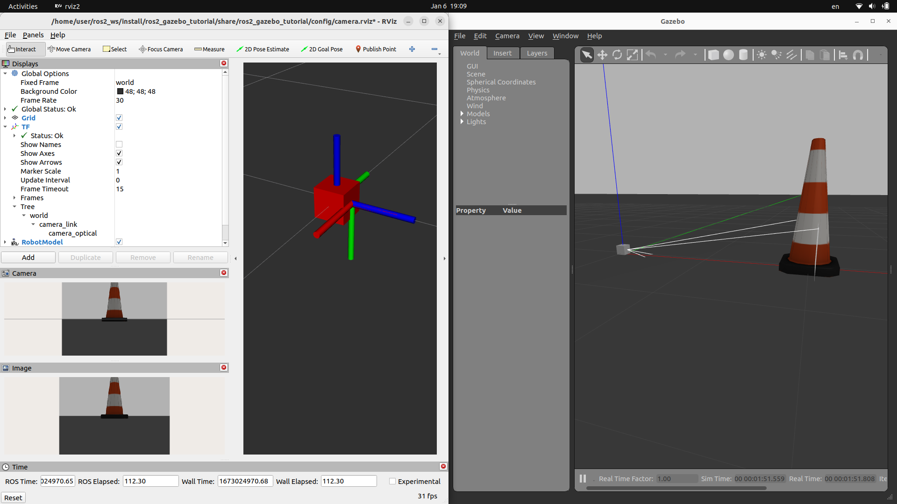

# ROS2 gazebo-classic camera sensor

Gazebo camera sensor with ROS2 plugin Tutorial

- Spawn camera SDF model into gazebo
- View Camera with correct TF in rviz
  - set plugin camera coordinate system (x:right, y:down, z:into the plan)




---
### Image Coordinate Frame

### Camera Coordinate Frame


### Robot Coordinate Frmae


---

### Rviz
#### Image
The Image display creates a new rendering window with an image 
config only the `image topic` with `sensor_msgs/Image` message

#### Camera
The Camera display creates a new rendering window from the perspective of a camera, and overlays the image from the camera on top of it. 
It use the `sensor_msgs/Image` message and `sensor_msgs/CameraInfo` message

---

### Demo 
Set camera sensor and ros plugin in urdf file

```xml
<!-- camera -->
<gazebo reference="camera_link">
  <sensor type="camera" name="camera1">
    <update_rate>30.0</update_rate>
    <camera name="head">
      <horizontal_fov>1.3962634</horizontal_fov>
      <image>
        <width>800</width>
        <height>800</height>
        <format>R8G8B8</format>
      </image>
      <clip>
        <near>0.02</near>
        <far>300</far>
      </clip>
      <noise>
        <type>gaussian</type>
        <!-- Noise is sampled independently per pixel on each frame.
              That pixel's noise value is added to each of its color
              channels, which at that point lie in the range [0,1]. -->
        <mean>0.0</mean>
        <stddev>0.007</stddev>
      </noise>
    </camera>
    <plugin name="camera_controller" filename="libgazebo_ros_camera.so">
      <alwaysOn>true</alwaysOn>
      <updateRate>0.0</updateRate>
      <cameraName>rrbot/camera1</cameraName>
      <imageTopicName>image_raw</imageTopicName>
      <cameraInfoTopicName>camera_info</cameraInfoTopicName>
      <frameName>camera_link_optical</frameName>
      <hackBaseline>0.07</hackBaseline>
      <distortionK1>0.0</distortionK1>
      <distortionK2>0.0</distortionK2>
      <distortionK3>0.0</distortionK3>
      <distortionT1>0.0</distortionT1>
      <distortionT2>0.0</distortionT2>
    </plugin>
  </sensor>
</gazebo>
```


---

## Reference
- [Making a Mobile Robot #9 - Adding a Camera](https://articulatedrobotics.xyz/mobile-robot-9-camera/)
- [SDF specification](http://sdformat.org/spec?ver=1.07&elem=sensor#sensor_camera)