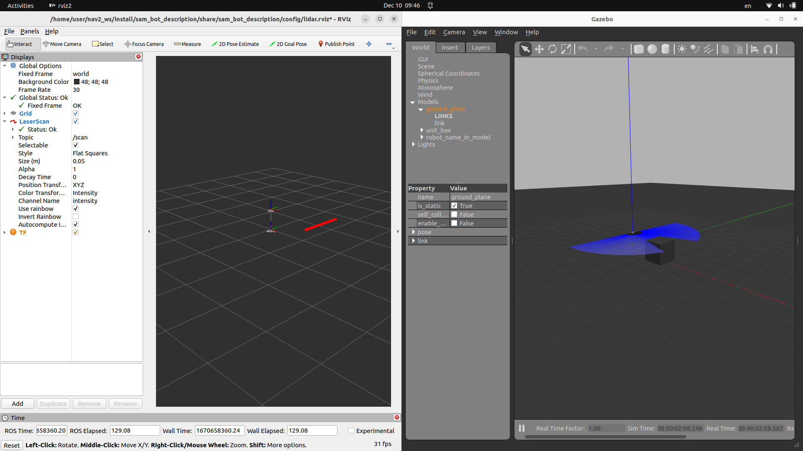

ROS2 using new plug `gazebo_ros_ray_sensor` to simulate `PointCloud`, `LaserScan` and `Range` output message control by `<output_type>` tag


sensor_msgs/PointCloud2: 3D cloud of points (default)
sensor_msgs/PointCloud: 3D cloud of points
sensor_msgs/LaserScan: 2D scan, uses center vertical ray if there are multiple
sensor_msgs/Range: Single distance value, minimum of all ray ranges of parent sensor


# SDF


<?xml version="1.0"?>
<sdf version="1.5">
    <model name="lidar_demo">
        <pose>0 0 0.5 0 0 0</pose>
        <static>true</static>
        <link name="link">
            <collision name="collision">
                <geometry>
                    <box>
                        <size>0.1 0.1 0.1</size>
                    </box>
                </geometry>
            </collision>
            <visual name="visual">
                <geometry>
                    <box>
                        <size>0.1 0.1 0.1</size>
                    </box>
                </geometry>
            </visual>
            <sensor name="lidar" type="ray">
                <always_on>true</always_on>
                <visualize>true</visualize>
                <update_rate>5</update_rate>
                <ray>
                  <scan>
                    <horizontal>
                      <samples>180</samples>
                      <resolution>1.00000</resolution>
                      <min_angle>-1.57</min_angle>
                      <max_angle>1.57</max_angle>
                    </horizontal>
                  </scan>
                  <range>
                    <min>0.5</min>
                    <max>3.5</max>
                    <resolution>0.1</resolution>
                  </range>
                </ray>
                <plugin name="scan" filename="libgazebo_ros_ray_sensor.so">
                  <ros>
                    <remapping>~/out:=scan</remapping>
                  </ros>
                  <output_type>sensor_msgs/LaserScan</output_type>
                  <frame_name>link</frame_name>
                </plugin>
              </sensor>
        </link>
    </model>
</sdf>
```     

---

# Run



---

# Reference
- [ROS 2 Migration: Ray sensors](https://github.com/ros-simulation/gazebo_ros_pkgs/wiki/ROS-2-Migration:-Ray-sensors#gazebo_ros_range)
