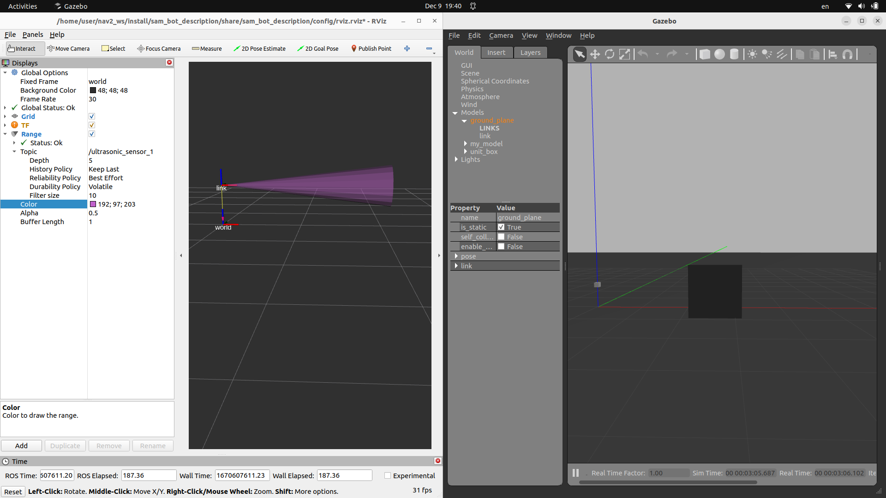

- Create simple model with ultrasonic sensor
- Spawn the model into gazebo world
- View sensor output in RVIZ


### sdf / sensor

```xml title="model.sdf" linenums="1" hl_lines="32 62"
<?xml version="1.0"?>
<sdf version="1.5">
    <model name="ultrasonic">
        <pose>0 0 0.5 0 0 0</pose>
        <static>true</static>
        <link name="link">
            <!-- <inertial>
                <mass>1.0</mass>
                <inertia>            
                    <ixx>0.083</ixx> 
                    <ixy>0.0</ixy>   
                    <ixz>0.0</ixz>   
                    <iyy>0.083</iyy> 
                    <iyz>0.0</iyz>   
                    <izz>0.083</izz> 
                </inertia>
            </inertial> -->
            <collision name="collision">
                <geometry>
                    <box>
                        <size>0.1 0.1 0.1</size>
                    </box>
                </geometry>
            </collision>
            <visual name="visual">
                <geometry>
                    <box>
                        <size>0.1 0.1 0.1</size>
                    </box>
                </geometry>
            </visual>
            <sensor name="ultrasonic_1" type="ray">
                <always_on>true</always_on>
                <visualize>false</visualize>
                <update_rate>5</update_rate>
                <ray>
                    <scan>
                        <horizontal>
                            <samples>5</samples>
                            <resolution>1.000000</resolution>
                            <min_angle>-0.12</min_angle>
                            <max_angle>0.12</max_angle>
                        </horizontal>
                        <vertical>
                            <samples>5</samples>
                            <resolution>1.000000</resolution>
                            <min_angle>-0.01</min_angle>
                            <max_angle>0.01</max_angle>
                        </vertical>
                    </scan>
                    <range>
                        <min>0.2</min>
                        <max>4</max>
                        <resolution>0.01</resolution>
                    </range>
                    <noise>
                        <type>gaussian</type>
                        <mean>0.0</mean>
                        <stddev>0.01</stddev>
                    </noise>
                </ray>
                <plugin name="ultrasonic_sensor" filename="libgazebo_ros_ray_sensor.so">
                    <ros>
                        <remapping>~/out:=ultrasonic_sensor_1</remapping>
                    </ros>
                    <output_type>sensor_msgs/Range</output_type>
                    <radiation_type>ultrasound</radiation_type>
                    <frame_name>link</frame_name>
                </plugin>
            </sensor>
        </link>
    </model>
</sdf>
```

---

### launch

```python title="sensor.launch.py" linenums="1" hl_lines="1"
import os
from launch import LaunchDescription
from launch.actions import AppendEnvironmentVariable, IncludeLaunchDescription
from launch.launch_description_sources import PythonLaunchDescriptionSource
from ament_index_python.packages import get_package_share_directory
from launch_ros.actions import Node

PACKAGE_NAME = "sam_bot_description"
WORLD = "gazebo.world"
MODEL = "ultrasonic"

def generate_launch_description():
    pkg_share = get_package_share_directory(PACKAGE_NAME)
    pkg_gazebo_ros = get_package_share_directory('gazebo_ros')
    model_sdf_full_path = os.path.join(pkg_share, "models", MODEL, "model.sdf")

    resources = [
        os.path.join(pkg_share, "worlds")    
    ]

    resource_env = AppendEnvironmentVariable(name="GAZEBO_RESOURCE_PATH", value=":".join(resources))

    start_gazebo_server_cmd = IncludeLaunchDescription(
        PythonLaunchDescriptionSource(os.path.join(pkg_gazebo_ros, 'launch', 'gzserver.launch.py')),
        launch_arguments={
            "verbose": "true", 
            'world': WORLD}.items())

    start_gazebo_client_cmd = IncludeLaunchDescription(
        PythonLaunchDescriptionSource(os.path.join(pkg_gazebo_ros, 'launch', 'gzclient.launch.py')))
        
    spawn_entity_cmd = Node(
        package="gazebo_ros", 
        executable="spawn_entity.py",
        arguments=['-entity', "robot_name_in_model", 
        '-file', model_sdf_full_path,
        '-x', "0",
        '-y', "0",
        '-z', "0.5"],
        output='screen')

    ld = LaunchDescription()
    rviz = Node(
        package="rviz2",
        executable="rviz2",
        arguments=["-d", os.path.join(pkg_share, "config", "ultrasonic.rviz")],
    )

    link_tf = Node(
        package='tf2_ros',
        executable='static_transform_publisher',
        name="link2world",
        arguments = ["0", "0", "0.5", "0", "0", "0", "world", "link"]
    )

    ld = LaunchDescription()
    ld.add_action(resource_env)
    ld.add_action(start_gazebo_server_cmd)
    ld.add_action(start_gazebo_client_cmd)
    ld.add_action(spawn_entity_cmd)
    ld.add_action(rviz)
    ld.add_action(link_tf)
    return ld
```

---

### tf

- Add static tf between world to link (model)

```python
link_tf = Node(
        package='tf2_ros',
        executable='static_transform_publisher',
        name="link2world",
        arguments = ["0", "0", "0.5", "0", "0", "0", "world", "link"]
    )
```

---

### run

