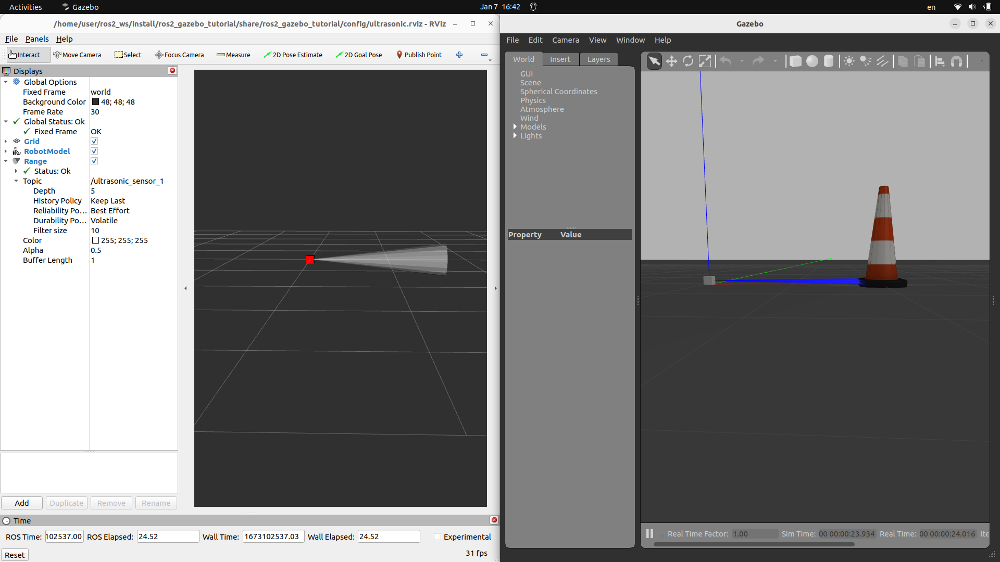
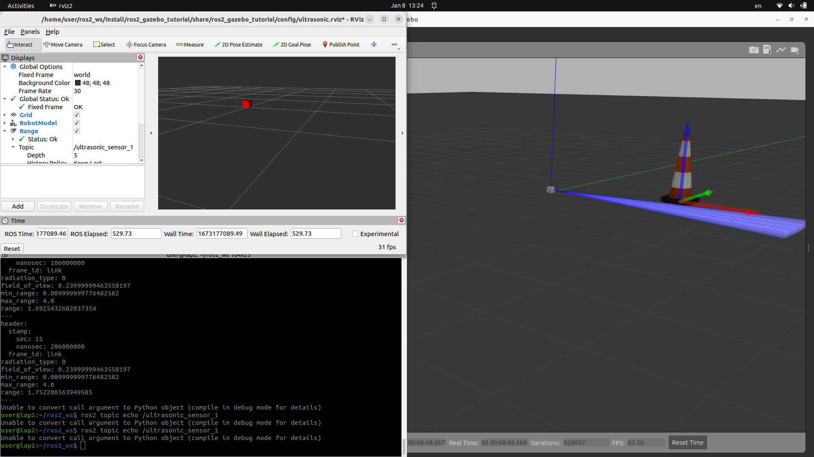

- Create simple model with ultrasonic sensor
- Spawn the model into gazebo world
- View sensor output in RVIZ


### sdf / sensor

```xml title="ultrasonic/model.sdf" linenums="1" hl_lines="32 62"
--8<-- "/home/user/ros2_ws/src/ros2_gazebo_tutorial/models/ultrasonic/model.sdf"
```

---

### launch
```python title="launch/ultrasonic.launch.py" linenums="1" hl_lines="1"
--8<-- "/home/user/ros2_ws/src/ros2_gazebo_tutorial/launch/ultrasonic.launch.py"
```
---

### tf

- Add static tf between world to link (model)

```python
link_tf = Node(
        package='tf2_ros',
        executable='static_transform_publisher',
        name="link2world",
        arguments = ["0", "0", "0", "0", "0", "0", "world", "link"]
    )
```

### Test sensor read
```python title="ultrasonic_demo_.py" linenums="1" hl_lines="1"
--8<-- "/home/user/ros2_ws/src/ros2_gazebo_tutorial/ros2_gazebo_tutorial/ultrasonic_demo.py"
```
---

### run



---

### run again

!!! warning "out of range reading"
    When sensor reading is out of range:
    - The visual marker turn brighter
    - Rviz stop show marker
    - BUG: subscriber stop read data from topic
     

```bash title="echo topic"
ros2 topic echo /ultrasonic_sensor_1 
Unable to convert call argument to Python object (compile in debug mode for details)
```


